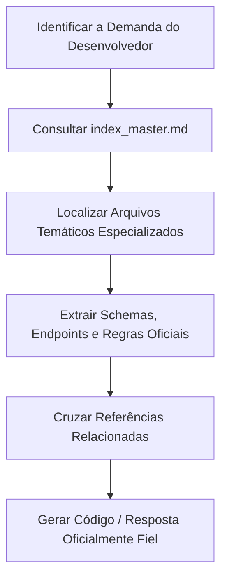

# Skill Appmax API - Guia de Utilização para Agentes de IA

Esta Skill fornece a base de conhecimento técnica oficial e exaustiva da **Appmax API**, cobrindo todas as capacidades de processamento de pagamentos, checkout transparente, gestão de assinaturas, split de recebíveis, webhooks e ecossistema da AppStore da Appmax.

---

## Identidade e Propósito da Skill

- **Tecnologia**: Appmax API (REST v1, OAuth2, Appmax JS, Servidor MCP)
- **Domínio Oficial de Origem**: `https://docs.appmax.com.br/`
- **Escopo Coberto**:
  1. Fundamentos arquiteturais, conceitos de negócio e ciclo de vida de pedidos;
  2. Autenticação OAuth2 (App Credentials vs. Merchant Credentials);
  3. Gestão e instalação de aplicativos na Loja de Aplicativos (AppStore) e automação de credenciais (`url_callback`);
  4. Cadastro de clientes e catálogo de produtos;
  5. Criação de pedidos, cálculo de valores, pedido unificado (1-passo) e upsell pós-compra;
  6. Processamento de pagamentos: Cartão de Crédito com tokenização PCI, Pix (QR Code/EMV), Boleto Bancário e Apple Pay;
  7. Assinaturas e cobrança recorrente com gestão de ciclos, faturas e produtos;
  8. Split de pagamentos para marketplaces: Onboarding de recebedores, validação biométrica Facematch KYC, divisão de pedidos, saldos, antecipações e saques;
  9. Webhooks, rate limits, ferramentas MCP para agentes e integração com IA;
  10. Exemplos práticos funcionais de código em cURL, Node.js, PHP e Go.

---

## Instruções para o Agente de IA

### Quando Utilizar Esta Skill
Utilize esta Skill sempre que o desenvolvedor solicitar:
- Integração de pagamentos da Appmax em lojas virtuais, sistemas ou plataformas;
- Criação de aplicativos para a Loja de Aplicativos da Appmax;
- Obtenção de tokens OAuth2 e configuração de credenciais;
- Tokenização de cartão de crédito via `appmax.min.js` e antifraude;
- Emissão de Pix dinâmico ou boletos bancários;
- Estruturação de checkout transparente ou pedido unificado;
- Implementação de planos de assinatura e recorrência;
- Arquitetura de split de pagamentos e repasse para múltiplos recebedores;
- Configuração de endpoints de webhooks e validação de notificações;
- Resolução de erros e diagnóstico de falhas operacionais na Appmax.

### Como Navegar e Roteamento de Conhecimento
1. **Consulte sempre o [`index_master.md`](index_master.md)** como seu ponto de partida para identificar os arquivos exatos correspondentes à dúvida ou tarefa.
2. **Utilize a Tabela de Roteamento por Intenção** presente no `index_master.md` para encontrar o caminho do arquivo modular correto.
3. **Leia integralmente o arquivo temático específico** antes de gerar respostas ou código para o usuário.
4. **Siga as referências cruzadas (`Veja Também`)** presentes ao final de cada arquivo quando precisar relacionar endpoints (ex: `api/pedidos/criar_pedido.md` relacionado a `api/pagamentos/cartao_credito.md`).

---

## Regras Fundamentais para o Agente

1. **Prioridade Absoluta à Documentação Oficial**:
   - Responda estritamente com base nos endpoints, parâmetros, tipos e comportamentos documentados nesta Skill.
   - **Proibição de alucinação**: Não invente propriedades, endpoints ou parâmetros que não constem na documentação.
2. **Regras de Segurança de Cartão de Crédito**:
   - **Nunca recomende enviar dados de cartão (número, CVV, validade) diretamente do backend do merchant**.
   - Sempre instrua o uso de `appmax.min.js` no frontend para tokenizar o cartão (`card_token`) e capturar o IP real do cliente.
3. **Regra de Autenticação OAuth2**:
   - A Appmax **não utiliza refresh tokens**. Quando o token expira (`expires_in`), deve-se realizar uma nova chamada `POST /oauth/token` com as credenciais.
4. **Distinção de Identificadores**:
   - Não confunda o `app_id` (Numerical ID) do aplicativo com o `external-id` (UUID v4) da instalação da loja.
5. **Preservação de Exemplos de Código**:
   - Forneça exemplos de código completos e funcionais mantendo os headers obrigatórios (`Authorization: Bearer <token>`, `Content-Type: application/json`).

---

## Fluxo Recomendado de Execução



1. **Identificação**: Compreenda qual funcionalidade da Appmax está sendo implementada ou consultada.
2. **Roteamento**: Abra o [`index_master.md`](index_master.md) e localize o arquivo correspondente.
3. **Leitura Especializada**: Acesse o arquivo de referência técnica (ex: `api/pagamentos/pix.md`).
4. **Verificação de Regras**: Confira pré-requisitos, tipos de parâmetros, headers e validações necessárias.
5. **Entrega**: Forneça uma solução exata, correta e aderente ao padrão oficial da Appmax.

---

## Estrutura de Diretórios da Skill

```text
skills/APIs/App Max/
├── SKILL.md                          # Ponto de entrada e guia da Skill
├── index_master.md                   # Roteador mestre de conhecimento e intenções
├── sources_manifest.md               # Manifesto formal de proveniência documental
├── coverage_report.md                # Relatório de auditoria e cobertura total
├── fundamentos/                      # Visão macro, conceitos, identificadores e sandbox
├── primeiros_passos/                 # Quickstart, autenticação OAuth2 e Appmax JS
├── aplicativos/                      # AppStore, validação de URL, instalação e automação
├── api/
│   ├── introducao.md                 # Padrões da API REST
│   ├── clientes/                     # Gestão de compradores
│   ├── produtos/                     # Catálogo e estoque
│   ├── pedidos/                      # Criação, pedido unificado, upsell e rastreio
│   ├── pagamentos/                   # Cartão, Pix, Boleto, Parcelas e Apple Pay
│   ├── assinaturas/                  # Cobrança recorrente e gestão de ciclos
│   ├── estornos/                     # Reembolsos totais e parciais
│   ├── links_pagamento/              # Links de checkout hospedados
│   ├── split/                        # Split de pagamentos, recebedores e saques
│   ├── relatorios/                   # Extratos e conciliação
│   └── saques/                       # Gestão de saques e liquidação
├── guias_e_recursos/                 # Webhooks, rate limits, bancos COMPE, IA e MCP
└── exemplos/                         # Implementações completas ponta a ponta
```
