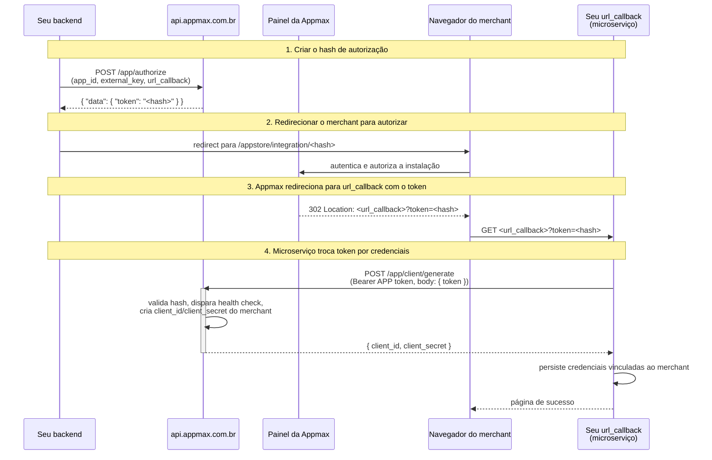

# Callback de instalação (`url_callback`)

Este guia detalha o que acontece entre o `POST /app/authorize` e a geração das credenciais do merchant em `POST /app/client/generate`, com foco no parâmetro `url_callback` e no `token` que chega até ele. Use esta página quando você precisa:

- Entender o formato exato da URL que a Appmax chama ao final da autorização.
- Direcionar o callback para um microserviço dedicado (onboarding, provisionamento, credenciais) em vez do front-end do seu painel.

Para uma visão de ponta a ponta do fluxo, veja [Instalação do aplicativo](fluxo_instalacao.md).

## Visão geral do fluxo



O `url_callback` recebe o `token` diretamente via query string, no próprio redirect do navegador. Não há troca adicional server-to-server autenticada **antes** do callback — é exatamente por isso que esse endpoint pode ser um microserviço independente do painel do integrador.

## Parâmetros de `POST /app/authorize`

O endpoint exige autenticação com o token do **aplicativo** (ver [Autenticação](../primeiros_passos/autenticacao.md#credenciais-do-aplicativo-app-credentials)).

```bash
curl --location 'https://api.appmax.com.br/app/authorize' \
  --header 'Content-Type: application/json' \
  --header 'Authorization: Bearer APP_ACCESS_TOKEN' \
  --data '{
    "app_id": "8f2c1d3e-5a4b-4c7d-9e1f-2a3b4c5d6e7f",
    "external_key": "store_42",
    "url_callback": "https://onboarding.meuapp.com/appmax/callback",
    "domain_names": ["minhaloja.com.br"]
  }'
```

- `app_id` (string, obrigatório): **App UUID** do aplicativo (não use o Numerical ID). Ex.: `8f2c1d3e-5a4b-4c7d-9e1f-2a3b4c5d6e7f`.

- `external_key` (string, obrigatório): Chave fornecida pela plataforma parceira para identificar a origem da instalação (ex.: `store_id`, `merchant_id`). Será devolvida no health check.

- `url_callback` (string, obrigatório): URL absoluta (com esquema `https://`) para onde o merchant será redirecionado ao fim da autorização. A Appmax anexa o `token` a essa URL (ver próxima seção).

- `domain_names` (string[]): Lista de domínios autorizados da loja. Use quando o app opera em mais de um domínio.

- `domain_name` (string): Alternativa no singular a `domain_names`. Mantido por compatibilidade retroativa.

> **Obrigatório para quem vai usar Apple Pay**
>
> Nenhum dos dois é exigido para a instalação em si, mas um deles é **essencial** se a loja for processar pagamentos com Apple Pay — é a partir do domínio informado aqui que a Appmax cadastra o domínio junto à Apple. Veja [Configuração de domínios para Apple Pay](../api/pagamentos/apple_pay_dominio.md).
**Resposta:**

```json
{
  "data": {
    "token": "12083w36219d223f33ecf48f2a7f5ccf143b0bc554"
  }
}
```

O `token` retornado aqui é um **hash opaco de uso único**, válido por **1 hora** (TTL no cache). Ele será usado tanto no redirect quanto posteriormente no `POST /app/client/generate`.

> **Formato do token**
>
> O `token` não é um JWT. É um identificador opaco (SHA1) que referencia os dados da instalação mantidos em cache pela Appmax. Não tente decodificá-lo — apenas repasse o valor como recebido.
## Redirecionamento para autorização

Após receber o hash, redirecione o merchant para a URL de autorização da Appmax:

| Ambiente  | URL de redirecionamento                                                  |
| --------- | ------------------------------------------------------------------------ |
| Sandbox   | `https://breakingcode.sandboxappmax.com.br/appstore/integration/HASH`    |
| Produção  | `https://admin.appmax.com.br/appstore/integration/HASH`                  |

Substitua `HASH` pelo valor de `token` devolvido em `/app/authorize`. O merchant autentica-se, revisa as permissões e confirma a instalação no painel da Appmax.

## Formato do callback

Depois que o merchant autoriza a instalação, a Appmax executa um **HTTP 302** do navegador do merchant para a sua `url_callback`, anexando o `token` como query string.

### Nome do parâmetro

O parâmetro sempre se chama `token`. Não é `code`, `access_token` nem `authorization_code`.

### Regra de concatenação

A Appmax concatena o `token` respeitando a query string existente:

- Se a `url_callback` **não** tem query string: `<url_callback>?token=<hash>`
- Se a `url_callback` **já** tem query string: `<url_callback>&token=<hash>`

### Exemplos

`url_callback` enviada em `/app/authorize`:

```
https://onboarding.meuapp.com/appmax/callback
```

URL recebida pelo merchant:

```
https://onboarding.meuapp.com/appmax/callback?token=12083w36219d223f33ecf48f2a7f5ccf143b0bc554
```

`url_callback` com parâmetros próprios (útil para propagar contexto/state):

```
https://onboarding.meuapp.com/appmax/callback?merchant_ref=42&state=xyz
```

URL recebida pelo merchant:

```
https://onboarding.meuapp.com/appmax/callback?merchant_ref=42&state=xyz&token=12083w36219d223f33ecf48f2a7f5ccf143b0bc554
```

> **Método do callback**
>
> O callback é um **GET** executado pelo navegador do merchant (redirect 302). Não é POST e não contém corpo. Todos os dados de contexto devem estar na query string da `url_callback` que você enviou originalmente.
## Trocando o token pelas credenciais

O `token` recebido no callback **não** é uma credencial — é um ticket de curta duração. Para obter as credenciais definitivas do merchant, seu backend precisa chamar `POST /app/client/generate` usando o token do **aplicativo** (não do merchant, que ainda não existe).

```bash
curl --location 'https://api.appmax.com.br/app/client/generate' \
  --header 'Content-Type: application/json' \
  --header 'Authorization: Bearer APP_ACCESS_TOKEN' \
  --data '{
    "token": "12083w36219d223f33ecf48f2a7f5ccf143b0bc554"
  }'
```

**Resposta:**

```json
{
  "data": {
    "client": {
      "client_id": "MERCHANT_CLIENT_ID",
      "client_secret": "MERCHANT_CLIENT_SECRET"
    }
  }
}
```

Durante o processamento dessa chamada, a Appmax executa o [health check](fluxo_instalacao.md#health-check) na sua URL de validação cadastrada no painel. Se a URL de validação não responder `HTTP 200` com um `external_id` UUID válido, a geração de credenciais falha.

> **O `external_id` é diferente do `token`**
>
> Não confunda os dois valores que aparecem neste fluxo:
>
> - **`token`** — chega na query string do redirect (`?token=...`), é **uso único** e existe só para trocar por credenciais.
> - **`external_id`** — UUID que você devolve no health check, fica **persistido** vinculado à loja e é usado em toda chamada da CDN (header `external-id`) a partir daí.
>
> Persista o `external_id` no seu banco junto com o `client_id` e o `client_secret`. Referência completa em [`external-id`](../fundamentos/external_id.md).
> **Uso único**
>
> O token é consumido na primeira chamada bem-sucedida a `/app/client/generate` — ele é removido do cache pela Appmax. Tentar reutilizá-lo devolve `Invalid token`. Se houver falha, é preciso iniciar um novo `/app/authorize`.
## Exemplo de handler do callback

Handler mínimo em Node.js (Express) mostrando as três responsabilidades do callback: extrair `token`, trocar por credenciais, persistir e confirmar.

```javascript
import express from 'express'
import axios from 'axios'

const app = express()

const APP_CLIENT_ID = process.env.APPMAX_APP_CLIENT_ID
const APP_CLIENT_SECRET = process.env.APPMAX_APP_CLIENT_SECRET
const AUTH_URL = 'https://auth.appmax.com.br/oauth2/token'
const API_URL = 'https://api.appmax.com.br'

// Obtem token do APP (cache em memoria recomendado em producao)
async function getAppAccessToken () {
  const body = new URLSearchParams({
    grant_type: 'client_credentials',
    client_id: APP_CLIENT_ID,
    client_secret: APP_CLIENT_SECRET
  })
  const { data } = await axios.post(AUTH_URL, body)
  return data.access_token
}

app.get('/appmax/callback', async (req, res) => {
  const { token, merchant_ref } = req.query

  if (!token) {
    return res.status(400).send('missing token')
  }

  try {
    const accessToken = await getAppAccessToken()

    const { data } = await axios.post(
      `${API_URL}/app/client/generate`,
      { token },
      { headers: { Authorization: `Bearer ${accessToken}` } }
    )

    const { client_id, client_secret } = data.data.client

    // Persiste as credenciais do merchant vinculadas ao seu merchant_ref
    await saveMerchantCredentials({
      merchant_ref,
      client_id,
      client_secret
    })

    return res.redirect('/onboarding/concluido')
  } catch (err) {
    console.error('appmax callback failed', err.response?.data ?? err.message)
    return res.status(502).send('failed to generate merchant credentials')
  }
})

app.listen(3000)
```

Versão equivalente em PHP puro (sem framework):

```php
<?php
// GET /appmax/callback?token=...&merchant_ref=...

$token = $_GET['token'] ?? null;
$merchantRef = $_GET['merchant_ref'] ?? null;

if (!$token) {
    http_response_code(400);
    exit('missing token');
}

// 1. Obtem o token do APP (credenciais do aplicativo)
$auth = curl_init('https://auth.appmax.com.br/oauth2/token');
curl_setopt_array($auth, [
    CURLOPT_RETURNTRANSFER => true,
    CURLOPT_POST => true,
    CURLOPT_POSTFIELDS => http_build_query([
        'grant_type' => 'client_credentials',
        'client_id' => getenv('APPMAX_APP_CLIENT_ID'),
        'client_secret' => getenv('APPMAX_APP_CLIENT_SECRET'),
    ]),
]);
$appToken = json_decode(curl_exec($auth), true)['access_token'];
curl_close($auth);

// 2. Troca o hash recebido pelas credenciais do merchant
$generate = curl_init('https://api.appmax.com.br/app/client/generate');
curl_setopt_array($generate, [
    CURLOPT_RETURNTRANSFER => true,
    CURLOPT_POST => true,
    CURLOPT_HTTPHEADER => [
        'Content-Type: application/json',
        'Authorization: Bearer ' . $appToken,
    ],
    CURLOPT_POSTFIELDS => json_encode(['token' => $token]),
]);
$response = json_decode(curl_exec($generate), true);
curl_close($generate);

$clientId = $response['data']['client']['client_id'] ?? null;
$clientSecret = $response['data']['client']['client_secret'] ?? null;

if (!$clientId || !$clientSecret) {
    http_response_code(502);
    exit('failed to generate merchant credentials');
}

// 3. Persiste as credenciais vinculadas ao merchant
saveMerchantCredentials($merchantRef, $clientId, $clientSecret);

header('Location: /onboarding/concluido');
```

## Por que isso habilita integrações baseadas em microserviços

Como o `token` chega ao `url_callback` via redirect do navegador, a URL pode apontar para **qualquer serviço HTTP público** — não precisa ser o mesmo host que iniciou o `/app/authorize`. Isso abre algumas arquiteturas comuns:

- **Microserviço de onboarding dedicado**: o painel do integrador inicia o fluxo, mas o callback aponta para um serviço isolado responsável apenas por provisionar o merchant (criar tenant, gerar recursos, salvar credenciais). O serviço de onboarding não precisa conhecer detalhes do painel.
- **Função serverless**: aponte `url_callback` para uma Lambda/Cloud Function. Ela troca o token pelas credenciais e grava em um banco ou cofre de segredos, sem manter servidor dedicado.
- **Separação de domínios**: o painel do integrador pode viver em `app.meudominio.com` enquanto o callback aponta para `onboarding.meudominio.com` — cada um com seu próprio deploy e política de segurança.

O ponto-chave é que **não há handshake server-to-server autenticado entre a Appmax e o seu `url_callback` antes do callback chegar**. O token é o próprio portador da autorização — quem tiver o token e as credenciais do app consegue concluir o fluxo. Isso simplifica o desenho do microserviço, que só precisa:

1. Expor um endpoint HTTPS público.
2. Ter acesso às credenciais do app (normalmente via cofre de segredos/variáveis de ambiente).
3. Ter acesso ao armazenamento onde as credenciais do merchant serão persistidas.

## Segurança

- **Use HTTPS** na `url_callback`. Tokens em query string sobre HTTP ficam visíveis a intermediários e aparecem em logs.
- **Valide contexto**: inclua um identificador próprio na `url_callback` (ex.: `?merchant_ref=42`) e confirme que ele corresponde a uma tentativa de instalação legítima do seu lado antes de chamar `/app/client/generate`.
- **Trate o token como segredo de curta duração**: TTL de 1h no cache da Appmax, consumido na primeira troca bem-sucedida. Não registre o token em logs estruturados sem mascarar.
- **Proteja as credenciais do app**: `client_id`/`client_secret` do aplicativo ficam no microserviço de callback. Use cofre de segredos (AWS Secrets Manager, Vault, Parameter Store) em produção.
- **Idempotência**: como o token é de uso único, chamadas repetidas a `/app/client/generate` com o mesmo token retornam `Invalid token`. Se o merchant der refresh na página de sucesso, desenhe seu handler para detectar o estado já provisionado antes de tentar trocar o token de novo.
- **Health check obrigatório**: a URL de validação cadastrada no painel do app precisa estar pública e responder `HTTP 200` com `external_id` UUID durante `/app/client/generate`. Sem isso, o callback recebe o token mas a troca falha. Veja [Health check](fluxo_instalacao.md#health-check).

## Erros comuns

| Sintoma | Causa provável | Correção |
| ------- | -------------- | -------- |
| Callback recebido sem query param `token` | `url_callback` já tinha fragment (`#`) ou erro na concatenação | Envie `url_callback` sem fragment; a Appmax só manipula query string |
| `/app/client/generate` retorna `Invalid token` | Token já consumido, expirado (>1h), ou nunca foi autorizado pelo merchant | Inicie um novo `/app/authorize` e refaça o fluxo |
| Callback chega mas microserviço não consegue chamar `/app/client/generate` | Falta do token do APP no microserviço (credenciais do app) | Garanta que o microserviço tenha acesso ao `client_id`/`client_secret` do aplicativo |
| `/app/client/generate` retorna `500` | Health check falhou na URL de validação | Veja [Troubleshooting de instalação](fluxo_instalacao.md#troubleshooting) |

## Veja também

- [Instalação do aplicativo](fluxo_instalacao.md) — fluxo completo com health check
- [Autenticação](../primeiros_passos/autenticacao.md) — diferença entre credenciais do app e do merchant
- [Criar aplicativo](criar_aplicativo.md) — cadastro da URL de validação usada no health check

## Veja Também

- [Index Master](../index_master.md)
- [Criar Aplicativo](criar_aplicativo.md)
- [Validar Url Instalacao](validar_url_instalacao.md)
- [Implementar Url Validacao](implementar_url_validacao.md)
