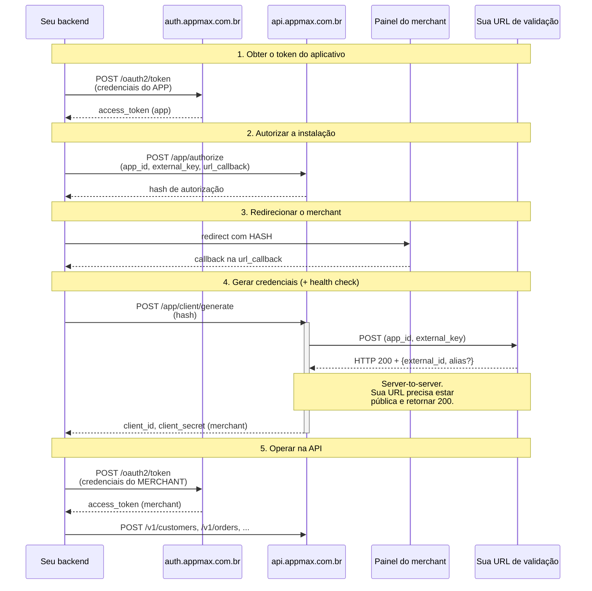

# Instalação do aplicativo

## Visão geral do fluxo

O diagrama abaixo mostra todas as chamadas envolvidas na instalação, incluindo a **chamada server-to-server** que a Appmax faz para a sua URL de validação durante o health check.



> **A etapa 4 combina duas ações em uma única requisição:**
>
> 1. Você chama `POST /app/client/generate` com o hash autorizado.
> 2. **Durante o processamento dessa chamada**, a Appmax faz um POST server-to-server para a URL de validação que você configurou.
> 3. Sua URL de validação precisa responder com HTTP 200 e um `external_id` (UUID) — só então a Appmax devolve as credenciais do merchant.
>
> O `external_id` que você devolve aqui **não é descartável** — ele vira o identificador atual dessa loja e será usado como header `external-id` em todas as chamadas do front via CDN. A cada nova instalação a Appmax exige um valor novo, e o anterior deixa de valer. Veja [`external-id`](../fundamentos/external_id.md) para entender onde esse valor vai ser consumido depois.
## Fluxo de instalação

#### 1. Obter o token do aplicativo

Antes de qualquer requisição, obtenha o token de acesso usando as credenciais do aplicativo.

**Endpoint:** `POST https://auth.appmax.com.br/oauth2/token`

```bash
curl --location 'https://auth.appmax.com.br/oauth2/token' \
--header 'Content-Type: application/x-www-form-urlencoded' \
--data-urlencode 'grant_type=client_credentials' \
--data-urlencode 'client_id=CLIENT_ID' \
--data-urlencode 'client_secret=CLIENT_SECRET'
```

**Resposta:**

```json
{
  "access_token": "eyJhbGciOiJIUzI1NiIsInR5cCI6Ikp...",
  "token_type": "Bearer",
  "expires_in": 3600
}
```

#### 2. Autorizar a instalação

Com o token de acesso do aplicativo, gere um hash de autorização para redirecionar o merchant.

**Endpoint:** `POST https://api.appmax.com.br/app/authorize`

```bash
curl --location 'https://api.appmax.com.br/app/authorize' \
--header 'Content-Type: application/json' \
--header 'Authorization: Bearer SEU_TOKEN' \
--data '{
  "app_id": "APP_ID",
  "external_key": "EXTERNAL_KEY",
  "url_callback": "URL_CALLBACK",
  "domain_name": "subdominio.dominio.com.br"
}'
```

**Resposta:**

```json
{
  "data": {
    "token": "12083w36219d223f33ecf48f2a7f5ccf143b0bc554"
  }
}
```

Parâmetros da requisição:

- `app_id` (string, obrigatório): **App UUID** do aplicativo. Use o UUID, não o Numerical ID (veja aviso abaixo).

- `external_key` (string, obrigatório): Chave fornecida pela plataforma parceira para identificar a origem da instalação (ex.: `store_id`, `merchant_id`).

- `url_callback` (string, obrigatório): URL para onde o usuário será redirecionado após a autorização.

- `domain_name` (string): Domínio da loja (subdomínio + domínio, ex.: `minhaloja.minhaintegracao.com.br`). Para enviar mais de um domínio na mesma instalação, use `domain_names` (array) no lugar de `domain_name`.

> **`domain_name` é essencial para quem vai usar Apple Pay**
>
> Não é obrigatório para a instalação em si, mas é **primordial** se a loja for processar pagamentos com Apple Pay: é a partir desse domínio, informado aqui, que a Appmax cadastra o domínio junto à Apple — parte do fluxo de habilitação do Apple Pay no dispositivo do cliente. Sem ele, o botão Apple Pay não funciona nessa loja, mesmo com o resto da integração correto. Você ainda precisa publicar o arquivo `.well-known` no domínio — veja [Configuração de domínios para Apple Pay](../api/pagamentos/apple_pay_dominio.md) e [Pagamento com Apple Pay](../api/pagamentos/apple_pay.md).
> **App UUID vs App Numerical ID**
>
> O aplicativo possui **dois identificadores** no painel:
>
> - **App UUID** — ex.: `8f2c1d3e-5a4b-4c7d-9e1f-2a3b4c5d6e7f`
> - **App Numerical ID** — ex.: `699`
>
> Use o **App UUID** em todos os endpoints da documentação oficial (incluindo este `POST /app/authorize`), exceto em `POST /app/client/generate` — ou quando o campo for explicitamente marcado como "Numerical ID".
>
> Confundir os dois é uma das causas mais comuns de `422 Unprocessable Entity` nesta etapa. Se você está recebendo esse erro, **verifique qual dos dois IDs está enviando**.
#### 3. Redirecionar o merchant

Redirecione o usuário para a URL de autorização, substituindo `HASH` pelo token gerado.

| Ambiente  | URL de redirecionamento                                                  |
| --------- | ------------------------------------------------------------------------ |
| Sandbox   | `https://breakingcode.sandboxappmax.com.br/appstore/integration/HASH`    |
| Produção  | `https://admin.appmax.com.br/appstore/integration/HASH`                  |

> **O redirecionamento é essencial para que o merchant autorize a instalação. Sem essa etapa, as credenciais do merchant não serão geradas.**
>
>
> **O merchant pode escolher uma loja que já existe**
>
> Nessa tela o merchant pode selecionar uma **loja já existente** da conta dele em vez de criar uma nova. O contrato da API não muda, mas a loja vinculada à instalação pode ser uma que já existia — inclusive uma em que seu app já esteve instalado. Veja [Reaproveitamento de loja na instalação](reaproveitar_loja.md).
#### 4. Gerar credenciais do merchant (+ health check)

Após o merchant autorizar a instalação, utilize o hash para gerar as credenciais.

**Endpoint:** `POST https://api.appmax.com.br/app/client/generate`

```bash
curl --location 'https://api.appmax.com.br/app/client/generate' \
--header 'Content-Type: application/json' \
--header 'Authorization: Bearer SEU_TOKEN' \
--data '{
  "token": "12083w36219d223f33ecf48f2a7f5ccf143b0bc554"
}'
```

**Resposta:**

```json
{
  "data": {
    "client": {
      "client_id": "MERCHANT_CLIENT_ID",
      "client_secret": "MERCHANT_CLIENT_SECRET"
    }
  }
}
```

> **O hash pode ser utilizado apenas uma vez. As credenciais geradas são válidas indefinidamente, até que o aplicativo seja desinstalado.**
>
>
### Health check
> **Implementando a URL de validação?**
>
> Se você precisa criar o endpoint em Go, Node.js ou PHP, veja o guia [Implementar a URL de validação](implementar_url_validacao.md) com exemplos de código prontos para rodar.
Durante essa requisição, a Appmax executa o **health check** para concluir a instalação. A Appmax envia um `POST` para a **URL de validação** informada no campo "URL de validação" durante a criação do aplicativo.

**Payload enviado:**

```json
{
  "app_id": 123,
  "client_id": "MERCHANT_CLIENT_ID",
  "client_secret": "MERCHANT_CLIENT_SECRET",
  "client_key": "EXTERNAL_KEY",
  "external_key": "EXTERNAL_KEY"
}
```

Campos do payload:

- `app_id` (integer, obrigatório): **App Numerical ID** do aplicativo (ID numérico, ex.: `123`). Atenção: aqui é o **Numerical ID, não o UUID** — diferente do `POST /app/authorize`. É o **único campo obrigatório** do payload: sempre estará presente em todas as chamadas de health check.

- `client_id` (string): **Opcional.** Client ID gerado para o merchant (credencial de API). Pode não ser enviado — não trate a ausência como erro.

- `client_secret` (string): **Opcional.** Client Secret gerado para o merchant (credencial de API). Pode não ser enviado — não trate a ausência como erro.

- `client_key` (string): **Opcional.** Mesmo valor de `external_key` (mantido por compatibilidade). Pode não ser enviado — não trate a ausência como erro.

- `external_key` (string): **Opcional.** Chave fornecida pelo merchant durante a instalação para identificação. Pode não ser enviada — não trate a ausência como erro.

> **app_id: Numerical ID, e somente ele é obrigatório**
>
> No payload do health check, **somente o `app_id` é obrigatório** — todos os demais campos são opcionais e podem não estar presentes. O `app_id` enviado é o **App Numerical ID** (ex.: `123`), **não o UUID**. Seu handler deve validar apenas a presença do `app_id` e tratar os outros campos como opcionais.
**Resposta esperada — HTTP 200:**

```json
{
  "external_id": "37bb0791-ee0b-457d-860c-186e32978bcd",
  "alias": "Minha Loja"
}
```

Quem **gera** esse `external_id` é você — a Appmax apenas o **persiste** vinculado à loja. Esse mesmo UUID volta depois como header `external-id` em toda chamada do front (tokenização, Apple Pay) — é o identificador daquela loja para a CDN. **Gere um UUID novo a cada requisição do health check**: valores repetidos são rejeitados pela Appmax — se o `external_id` recebido já existir na base, ele é descartado e substituído automaticamente pelo `client_id` da instalação. Persista no seu banco no momento em que gerar e, quando um novo health check acontecer, guarde sempre o último valor e descarte o anterior. Referência completa em [`external-id`](../fundamentos/external_id.md).

| Campo | Tipo | Obrigatório | Descrição |
| ----- | ---- | ----------- | --------- |
| `external_id` | string (UUID) | Sim | ID único da instalação no seu sistema. **Deve ser um UUID válido** (v1 a v5) e **único** entre todas as instalações. Esse mesmo valor é depois enviado como header `external-id` nas chamadas do front via CDN. |
| `alias` | string | Não | Nome do site/loja. Se enviado, será usado como nome de exibição na Appmax. |

> **O health check é **obrigatório** para concluir a instalação. Se sua URL não estiver disponível, retornar status diferente de `200` ou não devolver um `external_id` UUID válido no corpo, a instalação será considerada falha — o passo `/app/client/generate` aborta com `500` e nenhuma credencial é emitida. Teste sua URL em [Valide sua URL de validação](validar_url_instalacao.md) **antes** de iniciar o fluxo de instalação.**
>
>
> **O `external_id` **deve ser um UUID válido** (ex.: `37bb0791-ee0b-457d-860c-186e32978bcd`). Para aplicativos na categoria **Pagamentos e Segurança**, o `external_id` é estritamente obrigatório — a instalação falhará se ele não for enviado.**
>
>
> **Armazene o `external_id` no seu banco de dados para identificar o vínculo entre o merchant e o seu aplicativo. Cada instalação deve gerar um `external_id` diferente — valores duplicados serão rejeitados.**
>
>
> **Mesmo valor, da geração ao uso no front**
>
> O `external_id` que você devolve no health check **é exatamente o mesmo** que entra como header `external-id` em toda chamada do front via CDN. **Gere um UUID novo a cada requisição do health check** — valores repetidos são rejeitados pela Appmax e substituídos automaticamente pelo `client_id` da instalação. Persista assim que gerar e, a cada novo health check, substitua o valor guardado pelo mais recente, descartando o anterior. Detalhes de uso, parametrização no `AppCheckout.init` e diagnóstico de erros em [`external-id`](../fundamentos/external_id.md).
#### 5. Autenticar com as credenciais do merchant

Com as credenciais do merchant (`client_id` e `client_secret`) geradas na etapa anterior, autentique-se para obter o **token de acesso do merchant**. É esse token que autoriza as operações transacionais (`/v1/customers`, `/v1/orders`, `/v1/payments/*`).

**Endpoint:** `POST https://auth.appmax.com.br/oauth2/token`

```bash
curl --location 'https://auth.appmax.com.br/oauth2/token' \
--header 'Content-Type: application/x-www-form-urlencoded' \
--data-urlencode 'grant_type=client_credentials' \
--data-urlencode 'client_id=MERCHANT_CLIENT_ID' \
--data-urlencode 'client_secret=MERCHANT_CLIENT_SECRET'
```

**Resposta:**

```json
{
  "access_token": "eyJhbGciOiJIUzI1NiIsInR5cCI6Ikp...",
  "token_type": "Bearer",
  "expires_in": 3600
}
```

Use o `access_token` retornado como header `Authorization: Bearer SEU_TOKEN` nas chamadas transacionais da API.

> **É o **mesmo endpoint** usado para autenticar o aplicativo (etapa 1) — a diferença é enviar o `client_id`/`client_secret` **do merchant**. Enviar as credenciais do app aqui resulta em `401` nas rotas `/v1/*`.**
>
>
> **O token expira em **1 hora** e a API **não usa refresh token** — quando expirar, basta repetir esta mesma requisição. As credenciais do merchant, por outro lado, são permanentes (até a desinstalação). Entenda os dois tipos de credencial em [Autenticação](../primeiros_passos/autenticacao.md).**
>
>
## Resumo

1. Obtenha o token do aplicativo usando as credenciais do app.
2. Autorize a instalação gerando um hash.
3. Redirecione o merchant para autorizar.
4. Gere as credenciais com `POST /app/client/generate` — **durante essa request, a Appmax envia o health check** para sua URL de validação. Responda com HTTP 200 e o `external_id` para concluir a instalação.
5. **Autentique-se com as credenciais do merchant** em `POST /oauth2/token` para obter o token de acesso e transacionar na API (`/v1/*`).

## Troubleshooting

Os erros mais comuns durante a instalação e como resolver.

### `422 Unprocessable Entity` em `POST /app/authorize`

**Causa mais provável:** você está enviando o **App Numerical ID** em vez do **App UUID** no campo `app_id`.

**Correção:** copie o **App UUID** do painel (formato `8f2c1d3e-5a4b-...`) e envie nesse campo. O Numerical ID (inteiro) só é usado em `POST /app/client/generate`, nunca aqui.

### `422 Unprocessable Entity` em `POST /app/client/generate`

**Causas possíveis:**

1. **Hash inválido ou já usado** — cada hash só pode ser usado uma vez. Se você tentou e falhou, precisa gerar um novo hash com `POST /app/authorize`.
2. **Merchant não passou pelo redirect** — você pulou a etapa 3. Sem o redirect e autorização no painel, o hash não fica válido para gerar credenciais.
3. **Hash expirado** — hashes têm tempo de vida limitado. Gere um novo e conclua o fluxo imediatamente.

**Correção:** siga o fluxo completo na ordem: `authorize` → redirect → autorização no painel → `client/generate`.

### `500 Internal Server Error` em `POST /app/client/generate`

**Causa mais provável:** o health check falhou. A Appmax tentou chamar sua URL de validação e:

- A URL não respondeu (timeout, DNS, firewall, ou URL errada no painel).
- A URL respondeu com status diferente de `200`.
- A URL respondeu com `200` mas **sem um `external_id` válido em UUID** no corpo JSON.

**Correção:**

1. Verifique se a URL de validação está correta no painel do aplicativo.
2. Teste manualmente com `curl` — ela deve responder a POST com HTTP 200 e JSON contendo `{"external_id": "<UUID válido>"}`.
3. Cheque os logs do seu servidor para o POST que a Appmax enviou.
4. Confirme que você **não está usando `localhost`** ou URL privada — a Appmax precisa alcançar a URL publicamente.

### Recebi o POST na URL de validação, mas o `POST /app/client/generate` retorna erro

**Causa:** sua URL de validação recebeu o payload mas não respondeu corretamente — provavelmente:

- Respondeu com status diferente de `200` (ex.: `204`, `301`, `500`).
- Retornou `200` mas **sem JSON com `external_id`** no corpo.
- Retornou um `external_id` **que não é UUID válido** ou **que já foi usado** em outra instalação.

**Correção:** seu handler da URL de validação deve:

1. Retornar **HTTP 200** explicitamente.
2. Incluir no corpo um JSON com `{"external_id": "<UUID v1-v5>"}`.
3. Gerar um `external_id` único por instalação (ex.: `uuid.v4()`).

### A URL de validação está em `localhost` (desenvolvimento)

A Appmax não consegue alcançar URLs privadas. Durante desenvolvimento:

- Use um serviço de tunnel como [ngrok](https://ngrok.com), [beeceptor](https://beeceptor.com) ou similar.
- Configure a URL pública no painel do aplicativo.
- Quando publicar em produção, atualize para a URL definitiva.

### Credenciais do app (`client_id`/`client_secret`) não funcionam em rotas `/v1/*`

**Causa:** credenciais do aplicativo só funcionam em `POST /app/authorize` e `POST /app/client/generate`. Para rotas transacionais (`/v1/customers`, `/v1/orders`, etc.), use as **credenciais do merchant** geradas na etapa 4.

Veja [Autenticação](../primeiros_passos/autenticacao.md) para entender os dois tipos de credenciais.

### Erros no uso do `external_id` no front (CDN)

Os erros desta página cobrem a **geração** do `external_id` no health check. Se a instalação concluiu mas o front (tokenização, Apple Pay) está retornando `401 Missing Authorization token`, `404 Merchant not found`, `404 Client id not found` ou `External ID is required`, esses são erros de **uso** do header `external-id` — a tabela de diagnóstico completa está em [Erros comuns e diagnóstico](../fundamentos/external_id.md#erros-comuns-e-diagnostico).

### Mais ajuda

Se seu erro não está listado acima:

- Consulte o [FAQ](../guias_e_recursos/faq.md).
- Verifique o [Rate Limit](../guias_e_recursos/rate_limit.md) se estiver recebendo `429`.
- Use o MCP `appmax-docs` (ferramenta `diagnose_error`) passando o status code e o endpoint para um diagnóstico automatizado.

## Veja Também

- [Index Master](../index_master.md)
- [Criar Aplicativo](criar_aplicativo.md)
- [Validar Url Instalacao](validar_url_instalacao.md)
- [Implementar Url Validacao](implementar_url_validacao.md)
