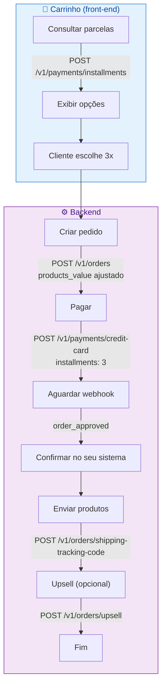

# Checkout com múltiplos produtos

Este exemplo mostra um cenário real de e-commerce: carrinho com vários itens, frete, desconto e pagamento — incluindo o cálculo correto dos valores para parcelamento.

> **Os exemplos usam URLs de sandbox. Para produção, substitua `sandboxappmax` por `appmax`.**
>
>
## Cenário

O cliente tem no carrinho:

| Produto | Qtd | Valor unit. | Subtotal |
|---------|-----|-------------|----------|
| Camiseta P | 2 | R$ 79,90 | R$ 159,80 |
| Boné | 1 | R$ 45,00 | R$ 45,00 |

- **Subtotal:** R$ 204,80
- **Frete:** R$ 18,50
- **Cupom de desconto:** R$ 20,00
- **Total:** R$ 203,30
- **Pagamento:** 3x no cartão

## Pré-requisitos

- Token de autenticação válido ([como obter](../primeiros_passos/autenticacao.md))
- `customer_id` do cliente com endereço cadastrado ([como criar](../api/clientes/criar_atualizar_cliente.md))

---

## 1. Consultar parcelas sobre o valor total

O valor base para o cálculo de parcelas é **subtotal + frete - desconto**:

`20480 + 1850 - 2000 = 20330` centavos

```bash
curl --request POST \
     --url https://api.sandboxappmax.com.br/v1/payments/installments \
     --header 'Authorization: Bearer SEU_TOKEN' \
     --header 'Accept: application/json' \
     --header 'Content-Type: application/json' \
     --data '{
  "installments": 3,
  "total_value": 20330,
  "settings": true
}'
```

```json
{
  "data": {
    "installments": {
      "1": { "total": 20330 },
      "2": { "total": 20736 },
      "3": { "total": 21147 }
    },
    "settings": {
      "modality": "PP",
      "max_installments": 12,
      "min_installment_value": 500
    }
  }
}
```

O cliente escolhe **3x** → total com juros: **R$ 211,47** (`21147` centavos).

## 2. Distribuir os juros nos produtos

Os juros são R$ 8,17 (`21147 - 20330 + 2000 - 1850 = 817` centavos adicionais sobre o subtotal original). Distribua proporcionalmente:

```javascript
const produtos = [
  { sku: 'CAM-P', nome: 'Camiseta P', qtd: 2, valorOriginal: 7990 },
  { sku: 'BONE-01', nome: 'Boné', qtd: 1, valorOriginal: 4500 }
];

const subtotalOriginal = 20480; // 159,80 + 45,00
const totalComJuros = 21147;
const frete = 1850;
const desconto = 2000;

// Valor de produtos que precisamos enviar:
// totalComJuros - frete + desconto = valor_produtos ajustado
// Mas como usamos products_value, enviamos o valor total ajustado
const productsValue = totalComJuros - frete + desconto;
// 21147 - 1850 + 2000 = 21297
```

> **Use `products_value` para enviar o valor total dos produtos já com juros. Assim você não precisa recalcular cada `unit_value` individualmente.**
>
>
## 3. Criar o pedido

```bash
curl --request POST \
     --url https://api.sandboxappmax.com.br/v1/orders \
     --header 'Authorization: Bearer SEU_TOKEN' \
     --header 'Accept: application/json' \
     --header 'Content-Type: application/json' \
     --data '{
  "customer_id": 2023,
  "products_value": 21297,
  "shipping_value": 1850,
  "discount_value": 2000,
  "products": [
    {
      "sku": "CAM-P",
      "name": "Camiseta P",
      "quantity": 2,
      "type": "physical"
    },
    {
      "sku": "BONE-01",
      "name": "Boné",
      "quantity": 1,
      "type": "physical"
    }
  ]
}'
```

```json
{
  "data": {
    "order": {
      "id": 6001,
      "status": "pendente"
    }
  }
}
```

> **Quando usar `products_value`, **não informe** `unit_value` nos produtos. Os dois modos são mutuamente exclusivos. Veja [regras de cálculo](../api/pedidos/calculo_valor_pedido.md) para detalhes.**
>
>
## 4. Processar o pagamento

```bash
curl --request POST \
     --url https://api.sandboxappmax.com.br/v1/payments/credit-card \
     --header 'Authorization: Bearer SEU_TOKEN' \
     --header 'Accept: application/json' \
     --header 'Content-Type: application/json' \
     --data '{
  "order_id": 6001,
  "customer_id": 2023,
  "payment_data": {
    "credit_card": {
      "token": "422146c7523a46119d6073ea56193913",
      "holder_document_number": "25226493029",
      "holder_name": "Junior Almeida",
      "installments": 3,
      "soft_descriptor": "MINHALOJA"
    }
  }
}'
```

```json
{
  "data": {
    "order": {
      "id": 6001,
      "status": "autorizado"
    },
    "payment": {
      "method": "creditcard",
      "installments": 3,
      "paid_at": "2025-03-15 14:30:00"
    },
    "upsell_hash": "6000114202503117156088040208561001715608804"
  }
}
```

## 5. Cadastrar o código de rastreio

Como o pedido contém produtos físicos, cadastre o rastreio após o envio para liberar os saques:

```bash
curl --request POST \
     --url https://api.sandboxappmax.com.br/v1/orders/shipping-tracking-code \
     --header 'Authorization: Bearer SEU_TOKEN' \
     --header 'Accept: application/json' \
     --header 'Content-Type: application/json' \
     --data '{
  "order_id": 6001,
  "shipping_tracking_code": "BR123456789XX"
}'
```

```json
{
  "data": {
    "message": "tracking accepted"
  }
}
```

## 6. Oferecer um upsell (opcional)

Após o pagamento, ofereça um produto complementar usando o `upsell_hash`:

```bash
curl --request POST \
     --url https://api.sandboxappmax.com.br/v1/orders/upsell \
     --header 'Authorization: Bearer SEU_TOKEN' \
     --header 'Accept: application/json' \
     --header 'Content-Type: application/json' \
     --data '{
  "upsell_hash": "6000114202503117156088040208561001715608804",
  "products_value": 2990,
  "products": [
    {
      "sku": "MEIA-01",
      "name": "Kit meias esportivas",
      "quantity": 1,
      "unit_value": 2990,
      "type": "physical"
    }
  ]
}'
```

O upsell é cobrado automaticamente no mesmo cartão, sem o cliente precisar inserir os dados novamente.

---

## Diagrama do fluxo completo



---

## Resumo dos valores

| Campo | Valor | Centavos |
|-------|-------|----------|
| Subtotal (2 camisetas + 1 boné) | R$ 204,80 | `20480` |
| Frete | R$ 18,50 | `1850` |
| Desconto | -R$ 20,00 | `2000` |
| Juros (3x) | R$ 8,17 | `817` |
| **Total cobrado** | **R$ 211,47** | **`21147`** |
| Parcela no cartão | 3x R$ 70,49 | `7049` |

## Veja Também

- [Index Master](../index_master.md)
- [Listar Produtos](../api/produtos/listar_produtos.md)
- [Consultar Produto](../api/produtos/consultar_produto.md)
- [Criar Produto](../api/produtos/criar_produto.md)
