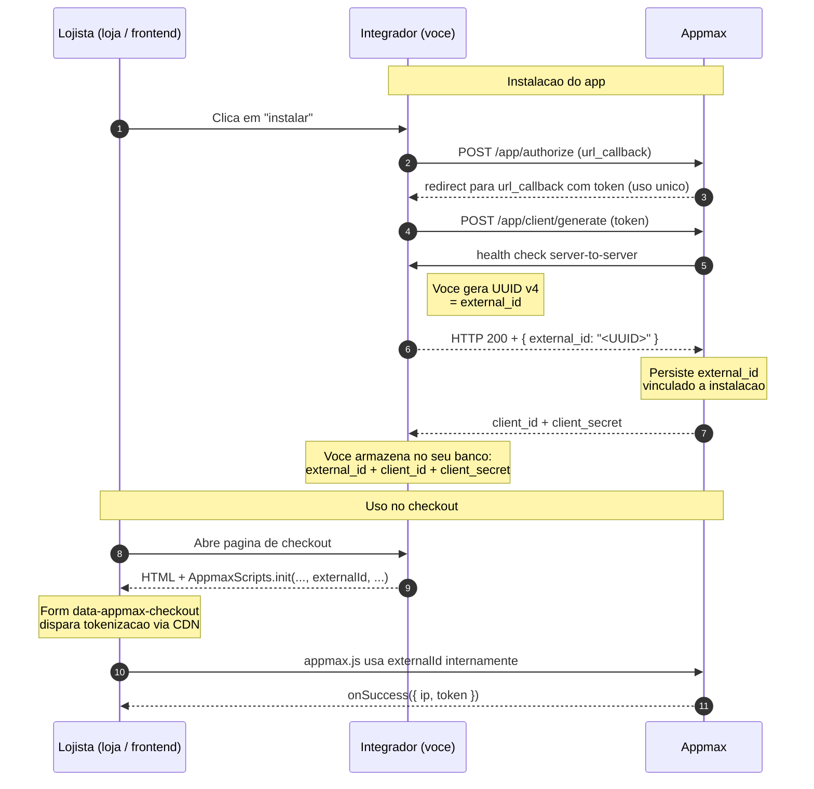

# `external-id`

Identificador único da instalação do seu aplicativo em uma loja. Ele amarra cada chamada feita a partir do navegador do cliente final (CDN, tokenização, Apple Pay) ao merchant correto na Appmax.

Esta página é a referência central. Outras páginas linkam para cá em vez de repetir o conteúdo.

## Convenção `external-id` vs `external_id`

O mesmo identificador aparece com duas grafias na documentação — é o **mesmo valor**, em formatos diferentes:

| Grafia        | Onde aparece                                                                                  |
| ------------- | --------------------------------------------------------------------------------------------- |
| `external_id` | Corpo JSON do health check (`{ "external_id": "..." }`), campo armazenado no seu banco.       |
| `external-id` | Nome do **header HTTP** enviado em chamadas da CDN para o gateway de pagamento.               |

A convenção segue o costume HTTP (headers em `kebab-case`, JSON em `snake_case`). Mentalmente, trate como o mesmo valor — é o mesmo string entre os dois formatos.

## O que é

O `external-id` é um **identificador**, não um secret. Ele identifica o par **(aplicativo instalado + loja)** para a plataforma. Quando seu front faz uma chamada para o gateway de pagamento, a Appmax usa o `external-id` para identificar a loja e executar a operação no contexto correto.

Pontos importantes:

- **Não é credencial**. Não autentica a chamada. A autenticação da rota é responsabilidade da Appmax (gateway interno), não do integrador.
- **Quem gera é você**. O valor sai do seu lado durante a instalação — a Appmax apenas persiste e valida.
- **Não é sensível ao ponto de exigir vault**, mas trate-o como dado de configuração da loja: persistido no seu banco, vinculado ao merchant, lido a cada renderização da página de checkout.

O ciclo de vida do `external_id` é:



**O `external_id` é gerado pelo integrador durante o health check.** A Appmax apenas persiste e valida — não inventa esse valor. O mesmo UUID sai no health check (passo 6) e volta como parâmetro do `AppmaxScripts.init` no checkout (passo 11).

## De onde ele vem

O `external_id` é definido **durante a instalação do aplicativo em uma loja**. O fluxo:

1. Você inicia a instalação chamando [`POST /app/authorize`](../aplicativos/fluxo_instalacao.md#fluxo-de-instalacao).
2. O merchant autoriza no painel da Appmax e é redirecionado para o seu `url_callback` com um `token`.
3. Você troca o `token` por credenciais chamando [`POST /app/client/generate`](../aplicativos/callback_instalacao.md).
4. Durante o processamento dessa chamada, a Appmax faz um **health check server-to-server** para a sua URL de validação cadastrada no painel.
5. **A sua URL de validação responde com `HTTP 200` e um JSON contendo `external_id` (UUID).**
6. A Appmax persiste internamente o vínculo entre esse `external_id` e a loja.

O `external_id` que você devolve nesse health check é o mesmo valor que você precisa enviar como header `external-id` em todas as chamadas subsequentes da CDN para aquela loja.

Detalhes do formato (UUID v1-v5, unicidade, validação) em [Health check](../aplicativos/fluxo_instalacao.md#health-check).

> **Persista no momento da geração**
>
> Quando seu handler do callback gerar o `external_id` para responder ao health check, **persista esse valor no seu banco** vinculado ao merchant. Você vai precisar dele em toda renderização do checkout daquele merchant. Veja [Automatizar a criação de credenciais](../aplicativos/automacao_credenciais.md).
## Onde é usado

Você consome o `external_id` chamando os métodos públicos do [Appmax JS](../primeiros_passos/appmax_js.md) — o script encapsula o transporte HTTP para a Appmax e cuida de propagar o identificador onde for necessário. Os contextos em que ele aparece:

### 1. Inicialização do script — `AppmaxScripts.init`

No checkout do merchant, o `externalId` é o **terceiro parâmetro** de `init`:

```javascript
window.AppmaxScripts.init(onSuccess, onError, externalId, onUpdate, onAuthorize);
```

Sem ele, a tokenização de cartão e a inicialização do Apple Pay falham com `External ID is required` antes mesmo de chegar a fazer chamada HTTP.

### 2. Submit de form de cartão — `data-appmax-checkout`

Qualquer `` no DOM dispara, no submit, a tokenização do cartão pela CDN. O script reaproveita o `externalId` informado no `init` — você não precisa repetir nem mexer no header HTTP.

```html
<form data-appmax-checkout>
  <input name="card_number" />
  <input name="card_cvv" />
  ...
</form>
```

O token de cartão chega de volta ao seu código no callback `onSuccess({ ip, token })`.

### 3. Apple Pay — `onAuthorize`

Ao tocar no botão Apple Pay, o script abre a PaymentSheet do Safari, faz a validação do merchant via Apple **(usando o `externalId` por baixo)** e devolve o `appleToken` no callback `onAuthorize` que você passou no `init`. Você não chama endpoint nenhum — é só pegar o token e mandar para `POST /v1/payments/apple-pay` no seu backend.

> Você normalmente não escreve nenhuma chamada HTTP para `scripts.appmax.com.br` manualmente — o `appmax.js` faz por você. As páginas de [Tokenização](../api/pagamentos/cartao_credito.md#tokenizacao) e [Apple Pay merchant session](../api/pagamentos/apple_pay_merchant_session.md) existem para casos avançados (implementação custom sem o script) e para debug.

## Quando NÃO usar `external-id`

O `external-id` é exclusivo das chamadas que partem do **navegador via Appmax JS**. Em todos os outros lugares — especialmente no seu backend — ele não tem função.

**Não envie `external-id` nas chamadas server-to-server** que seu backend faz para `api.appmax.com.br` (criação de cliente, criação de pedido, pagamento, recorrência, split etc.). Essas chamadas usam `Authorization: Bearer` com o token do **merchant** obtido em `/oauth2/token` — o contexto da loja sai do próprio token JWT.

Resumo:

| Origem da chamada                                          | Como autenticar                              | Onde vai o `external_id`?              |
| ---------------------------------------------------------- | -------------------------------------------- | -------------------------------------- |
| Backend → `api.appmax.com.br` (transacional)               | `Authorization: Bearer <merchant_token>`     | Não vai — contexto sai do JWT.         |
| Navegador → Appmax JS (`AppmaxScripts.init`, form `data-appmax-checkout`, Apple Pay) | Configurado uma vez no `init` | O script propaga internamente; você não toca em headers nem em body. |

## Quando o `external_id` muda

O `external_id` é estável **enquanto a instalação está ativa**. Mas:

- **Reinstalação do app na mesma loja** gera um **novo** `external_id`. Vale tanto quando o merchant **remove e reinstala** seu aplicativo quanto quando ele **reinstala sem remover**, selecionando a mesma loja na tela de autorização (veja [Reaproveitamento de loja na instalação](../aplicativos/reaproveitar_loja.md)). Nos dois casos o valor antigo deixa de funcionar e o front precisa ser atualizado com o novo.
- **Lojas diferentes do mesmo merchant** têm `external_id` diferentes. Cada combinação (app instalado, loja) tem o seu — não dá para compartilhar entre lojas.

**Recomendação:** trate o `external_id` como dado vivo. Não chumbe no código nem em variável de ambiente — leia do seu banco a cada renderização do checkout, indexando pelo merchant.

## Erros comuns e diagnóstico

| Resposta                              | Onde aparece                | Causa provável                                                                                  | Como resolver                                                                                                  |
| ------------------------------------- | --------------------------- | ----------------------------------------------------------------------------------------------- | -------------------------------------------------------------------------------------------------------------- |
| `401 Missing Authorization token`     | Resposta HTTP do gateway    | A chamada chegou ao gateway **sem** o header `external-id` e **sem** `Authorization`.           | Confirme que o script da CDN foi inicializado com o `externalId` correto antes do submit do form.              |
| `404 Merchant not found`              | Resposta HTTP do gateway    | O valor enviado em `external-id` não corresponde a nenhuma instalação ativa.                    | Verifique se o front está usando o `external_id` desta loja, não de outra. Confirme que a instalação está ativa. |
| `404 Client id not found`             | Resposta HTTP do gateway    | O `external_id` existe, mas o vínculo de credenciais da loja está incompleto.                   | Abra chamado com o suporte. Geralmente indica que algo da instalação ficou pela metade.                        |
| `External ID is required`             | Erro do script no navegador | `AppmaxScripts.init(...)` foi chamado sem o terceiro parâmetro (`externalId` ausente ou vazio). | Garanta que o seu template renderiza o `externalId` da loja antes de chamar `init`.                            |

## Boas práticas

- **Persista** o `external_id` no seu banco junto com `client_id` e `client_secret` do merchant. Veja o exemplo em [Automatizar a criação de credenciais](../aplicativos/automacao_credenciais.md).
- **Nunca chumbe** o valor no código. Não há valor "default" nem "de teste" — cada instalação tem o seu.
- **Releia do banco** em cada renderização do checkout. Se você cacheia em sessão, invalide quando o merchant reinstalar o app.
- **Não exponha** o `external_id` em log público ou em rastreamento de terceiros desnecessariamente. Não é secret, mas é dado da instalação — mantenha a higiene mínima de dados de cliente.
- **Trate erros do script no front**: se `init` rejeitar com `External ID is required`, registre o erro e mostre ao usuário uma mensagem de "checkout indisponível, tente novamente em instantes" enquanto o problema é resolvido — não deixe o submit silenciosamente quebrado.

## Veja também

- [Instalação do aplicativo](../aplicativos/fluxo_instalacao.md) — fluxo completo onde o `external_id` é gerado.
- [Callback de instalação](../aplicativos/callback_instalacao.md) — handler do redirect que recebe o token.
- [Automatizar a criação de credenciais](../aplicativos/automacao_credenciais.md) — tutorial que persiste credenciais e o `external_id`.
- [Appmax JS](../primeiros_passos/appmax_js.md) — script da CDN que consome o `externalId` no `init`.
- [Pagamento com Apple Pay](../api/pagamentos/apple_pay.md) — uso de `externalId` na sessão do Apple Pay.

## Veja Também

- [Index Master](../index_master.md)
- [Visao Geral](visao_geral.md)
- [Por Onde Comecar](por_onde_comecar.md)
- [Conceitos](conceitos.md)
