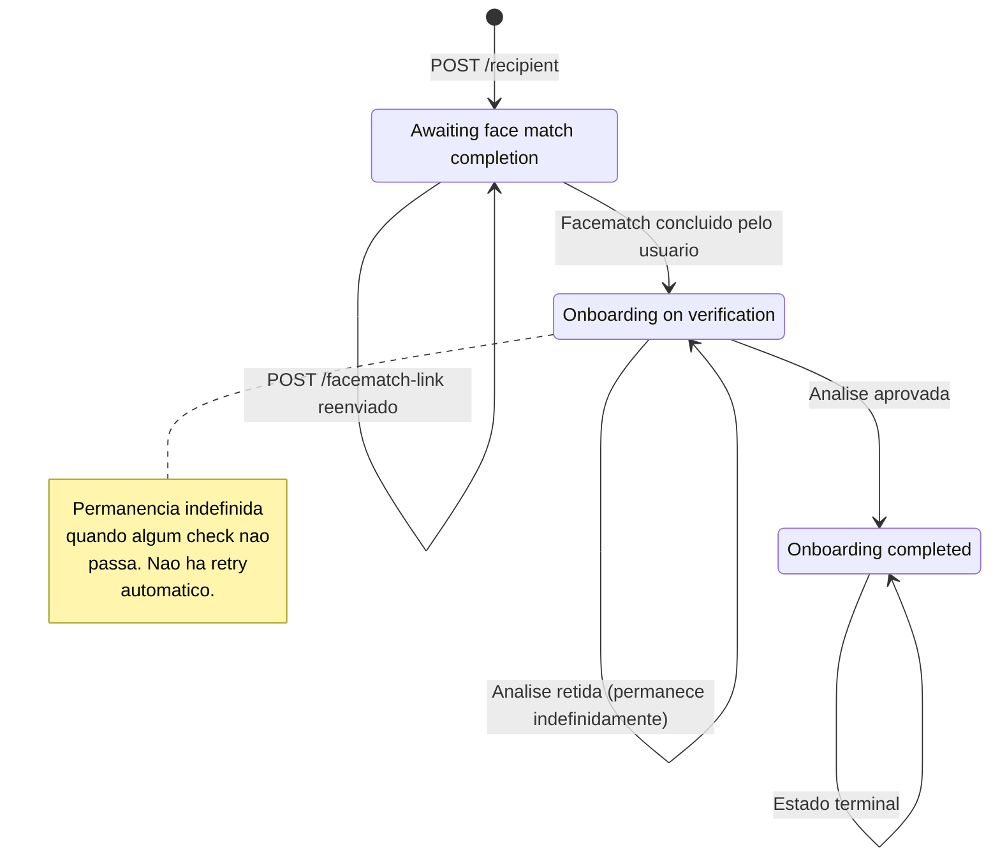

# Status do split de pagamentos

Referência consolidada de todos os status que um integrador pode observar no fluxo de split da Appmax — status de **recebedor** (retornado por `GET /recipient/{hash}/status`) e status de **solicitação de saque** (retornado por endpoints de `withdraw-request`). Use esta página como dicionário de enum: o que cada valor significa, quando aparece, o que esperar depois e qual a ação indicada para cada caso.

Para o fluxo completo e exemplos de código, veja [Split de pagamentos](split_visao_geral.md). Para dúvidas operacionais recorrentes, veja [Perguntas frequentes](split_faq.md).

## Status do recebedor (Recipient)

O status do recebedor é retornado pelo endpoint [`GET /recipient/{recipient_hash}/status`](../api/split/consultar_recebedor.md) como uma string no campo `data`. Existem **três valores possíveis**, sempre em inglês.

| Status                           | Significado                                                              | Pode participar de split? | Próxima ação esperada                                                 |
| -------------------------------- | ------------------------------------------------------------------------ | ------------------------- | --------------------------------------------------------------------- |
| `Awaiting face match completion` | Recebedor criado, aguardando o usuário concluir o facematch via SMS.     | Não                       | Disparar ou reenviar [link de facematch](../api/split/facematch_link.md) e aguardar o usuário concluir pelo celular. |
| `Onboarding on verification`     | Facematch concluído. Análise de KYC em andamento ou retida por algum check. | Não                       | Aguardar a liberação automática. Se permanecer além de 24-48h úteis, abrir chamado com o suporte. |
| `Onboarding completed`           | Onboarding aprovado. Recebedor habilitado a receber splits e sacar.      | Sim                       | Usar o `recipient_hash` em [`POST /orders/{orderId}/split-order`](../api/split/criar_split_pedido.md). |

### Transições entre estados

### Transições que **não** existem

- Não há transição de volta de `Onboarding completed` para os estados anteriores. Uma vez aprovado, o recebedor permanece aprovado.
- Não há transição de `Onboarding on verification` de volta para `Awaiting face match completion`. Chamar `POST /facematch-link` novamente nesse estado **não reinicia** a análise — a mensagem é aceita mas o status não muda.
- Não existe estado público de rejeição ou bloqueio (`rejected`, `denied`, `blocked`). Recebedores reprovados permanecem em `Onboarding on verification`.

### `Onboarding on verification` em detalhe

Este é o estado que mais gera dúvida porque **acumula dois cenários distintos sob o mesmo label**:

1. **Análise em andamento** — facematch foi recebido e o pipeline de KYC ainda está processando. Janela típica: minutos a poucas horas.
2. **Análise retida por falha de check** — o pipeline já processou, mas algum critério de KYC não foi atendido. O recebedor fica nesse estado **indefinidamente** até ação manual da Appmax.

O endpoint `GET /recipient/{hash}/status` **não distingue** os dois casos. Não existe campo `reason`, não existe status `rejected` e não há webhook que avise a mudança.

#### Motivos típicos que causam retenção

Entre os critérios verificados no onboarding:

- CPF ou CNPJ não validado na Receita Federal
- CNPJ sem o CPF do responsável no QSA (quadro societário)
- PEP (Pessoa Exposta Politicamente)
- OFAC (lista de sanções do Tesouro dos EUA)
- CSNU (lista de sanções do Conselho de Segurança da ONU)
- Score do facematch abaixo do limite mínimo
- Liveness (prova de vida) reprovada
- Face do facematch não coincide com a foto do documento

Nem todos os motivos são reportados ao integrador. O que retorna é apenas o label `Onboarding on verification`.

#### Ausência de retry automático e timeout

O sistema **não reprocessa automaticamente** um recebedor travado em `Onboarding on verification`. Não há timeout para sair desse estado, não há retry periódico e não há notificação de reprovação. Chamar `POST /facematch-link` novamente não reativa a análise dos documentos — apenas dispara outro SMS de facematch, que por si só não destrava os outros checks.

#### Ação recomendada

- **Até 24-48h úteis no estado `Onboarding on verification`**: aguardar. É janela normal de processamento.
- **Acima disso**: abrir chamado com o suporte da Appmax informando o `recipient_hash`. O time interno verifica se é caso de reprocessamento, análise manual ou reprovação definitiva.
- **Não recriar o recebedor**: o CNPJ retornará o erro `company document number já se encontra utilizado`.
- **Não travar o fluxo do usuário final**: sinalize ao lojista que o cadastro está em análise e dê um caminho alternativo enquanto aguarda.

## Status de solicitação de saque (WithdrawRequest)

Toda solicitação de saque — seja via [saldo disponível](../api/split/saque_disponivel.md) ou via [antecipação](../api/split/solicitar_antecipacao.md) — carrega um campo `status` que representa onde ela está no ciclo de processamento financeiro.

A resposta imediata dos endpoints `POST /withdraw-request/*` **sempre retorna `2` (`PENDING`)**, como um inteiro (ID). As transições subsequentes acontecem em background, no lado da Appmax. Para acompanhar o status atualizado, use [`GET /withdraw-request/{withdrawRequestId}`](../api/split/consultar_solicitacao_saque.md) — que retorna o `status` já traduzido como string (ex: `pending`, `approved`, `refused`). Não há webhook que notifique as transições; o acompanhamento é sempre via polling desse endpoint.

Esta seção documenta os **17 status possíveis** que podem aparecer ao consultar uma solicitação, em relatórios, ou em chamados de suporte.

### Status terminais

Estados que **não transitam mais**. Uma vez aqui, a solicitação está encerrada.

| ID | Constante   | Significado                                                                 | Ação do integrador |
| -- | ----------- | --------------------------------------------------------------------------- | ------------------ |
| 1  | `REFUSED`   | Solicitação recusada (erro de validação, saldo insuficiente após lock, reprovação de análise, falha definitiva do provedor de pagamento). | Investigar motivo via chamado. Se saldo voltou a estar disponível, criar nova solicitação. |
| 5  | `PAID`      | Valor liquidado — saiu da conta Appmax para a conta bancária do recebedor. | Nenhuma. Fluxo encerrado com sucesso. |

### Status em andamento

Estados intermediários. A solicitação ainda está sendo processada — aguardar transição natural.

| ID | Constante                  | Significado                                                                                       | Ação do integrador |
| -- | -------------------------- | ------------------------------------------------------------------------------------------------- | ------------------ |
| 2  | `PENDING`                  | Criado. Aguardando processamento ou aprovação interna. **Este é o valor devolvido na resposta imediata do `POST`.** | Nenhuma. Aguardar. |
| 3  | `APPROVED`                 | Aprovado internamente. Aguardando envio ao provedor de pagamento.                                 | Nenhuma. Aguardar. |
| 4  | `PROCESSING`               | Em processamento no provedor (envio ao banco ou cash-out).                                        | Nenhuma. Aguardar. |
| 7  | `WAITING_RETURN`           | Aguardando retorno do provedor de pagamento.                                                      | Nenhuma. Aguardar. |
| 8  | `INITIAL_ANALYSIS`         | Em análise inicial antes da aprovação.                                                            | Nenhuma. Aguardar. |
| 12 | `PIX_INCLUSION_IN_RETRY`   | Inclusão da chave PIX em retry automático junto ao provedor.                                      | Nenhuma. Aguardar. |
| 16 | `PIX_PROCESSING`           | Pagamento PIX em processamento no provedor.                                                       | Nenhuma. Aguardar. |
| 17 | `PIX_VALIDATION_API_UNAVAILABLE` | API de validação PIX do provedor está temporariamente indisponível.                         | Nenhuma. Aguardar ou abrir chamado se persistir. |

### Status que indicam ação da Appmax

Estados em que algo travou e **depende de intervenção manual** da Appmax para destravar. Se permanecer aqui por mais do que algumas horas, abra chamado.

| ID | Constante                       | Significado                                                                                   | Ação do integrador |
| -- | ------------------------------- | --------------------------------------------------------------------------------------------- | ------------------ |
| 6  | `ON_HOLD`                       | Bloqueio manual (análise de risco, verificação adicional).                                    | Abrir chamado se não desbloquear em janela razoável. |
| 9  | `PENDING_ACCREDITATION`         | Recebedor ainda não credenciado no provedor de cash-out.                                      | Aguardar. Abrir chamado se permanecer. |
| 10 | `APPROVED_BUT_NOT_INCLUDED`     | Aprovado internamente mas não incluído em lote de pagamento.                                  | Abrir chamado. |
| 11 | `PIX_ACCOUNT_VALIDATION_FAIL`   | Provedor falhou ao validar a chave PIX do recebedor.                                          | Abrir chamado para validar dados bancários. |
| 13 | `PIX_EXPIRED_INCLUSION`         | A inclusão do PIX expirou antes de completar.                                                 | Abrir chamado. |
| 14 | `PIX_INCLUDED_BUT_REPROVED`     | PIX foi incluído mas reprovado pelo provedor.                                                 | Abrir chamado. |
| 15 | `PIX_MANUAL_PAYMENT`            | Requer pagamento PIX manual pelo time financeiro da Appmax.                                   | Abrir chamado. |

### `withdrawal_blocked` — estado lateral invisível

Existe um bloqueio de saque que **não aparece no status do recebedor nem na solicitação de saque em si**. Trata-se de uma marcação lateral que pode ser ativada pela Appmax sobre a conta do recebedor por motivos como risco, investigação ou exigência regulatória. O efeito prático:

- O recebedor aparece com status `Onboarding completed` normalmente.
- Os saldos existem e podem ser consultados.
- Mas toda tentativa de criar uma solicitação de saque responde **HTTP 403** com erro `Withdraw not allowed`.

Se você receber `403` no `POST /withdraw-request/available` ou `POST /withdraw-request/anticipation` para um recebedor que deveria estar apto, trata-se provavelmente desse bloqueio — abra chamado com o suporte informando o `recipient_hash`.

Outro caso que também retorna 403 (ou 409 `Withdraw request in progress`) é quando já existe **outra solicitação em andamento** para o mesmo recebedor na mesma janela de processamento. Aguarde a finalização da solicitação anterior antes de criar nova.

## Elegibilidade consolidada por status do recebedor

Tabela cruzada mostrando, para cada status de recebedor, o que é e o que não é permitido:

| Status do recebedor              | Receber split em novo pedido | Ter saldos (`GET /balances`) | Sacar saldo disponível | Antecipar saldo a liberar |
| -------------------------------- | ---------------------------- | ---------------------------- | ---------------------- | ------------------------- |
| `Awaiting face match completion` | Não                          | Não (retorna 404)            | Não                    | Não                       |
| `Onboarding on verification`     | Não                          | Não (retorna 404)            | Não                    | Não                       |
| `Onboarding completed`           | Sim                          | Sim                          | Sim, salvo `withdrawal_blocked` ou saque em progresso | Sim, salvo `withdrawal_blocked` ou saque em progresso |

**Observação sobre o `GET /balances`**: antes de `Onboarding completed`, o endpoint [`GET /recipient/{hash}/balances`](../api/split/saldos.md) retorna `404 Balance not found`. Isso **não** significa que o recebedor não existe — significa apenas que os saldos ainda não foram provisionados. Use `GET /status` como fonte primária da existência e elegibilidade do recebedor.

## O que o status **não** conta

### Split não tem status próprio

A entidade split de pedido **não possui ciclo de vida separado**. O status efetivo de um split acompanha o [status da order pai](../fundamentos/status_pedidos.md):

- Order `pendente` → split criado e aguardando aprovação.
- Order `aprovado` → split consolidado, valores entram no fluxo de saldo dos recebedores.
- Order `cancelado` ou `estornado` → split descartado junto com a order.

Não existe endpoint `GET /split-order/{id}/status` nem campo `split_status`. Não existe webhook específico de split. Para saber se um split foi efetivado, consulte o status da order.

### Não há webhook de mudança de status de recebedor

Hoje **não existe evento** que notifique transição de recebedor entre `Awaiting face match completion`, `Onboarding on verification` e `Onboarding completed`. O integrador precisa fazer polling do endpoint `GET /status`. Também não há webhook para transições de `WithdrawRequest`.

Recomendações:

- Fazer polling em intervalos razoáveis (ex: a cada 1-5 minutos durante o onboarding ativo, reduzindo para horário após a primeira hora).
- Evitar polling agressivo (mais de 1 chamada por segundo) — a API tem [rate limit](rate_limit.md).
- Para recebedores em `Onboarding on verification` há mais de 24h úteis, parar o polling e partir para suporte.

### Estornos parciais são bloqueados em pedidos com split

Pedidos com split **só aceitam estorno total**. Tentar um [estorno parcial](../api/estornos/criar_estorno.md) em uma order com split retorna erro de validação. Essa é uma regra de produto, não um status — detalhada em [Criar split de pedido](../api/split/criar_split_pedido.md).

## Perguntas que só o suporte responde

Alguns dados não aparecem na API e não estão publicamente documentados — exigem chamado de suporte para obter resposta caso a caso:

- **Qual provedor de KYC é usado no facematch e nas checagens documentais.** Não é exposto na API.
- **Por que um recebedor específico caiu em `Onboarding on verification`.** O motivo detalhado (qual check falhou) não é retornado.
- **SLA de conclusão da análise de um recebedor específico.** Apenas a janela típica (24-48h úteis) é pública.
- **Previsão de transição de um `WithdrawRequest` específico entre os estados.** O tempo varia por provedor e janela bancária.
- **Motivo de `withdrawal_blocked` ter sido ativado em uma conta.** Exige chamado com o `recipient_hash`.

Em todos esses casos, ao abrir chamado, inclua sempre o `recipient_hash` (ou `withdraw_request_id` quando aplicável) — isso permite ao suporte localizar o registro imediatamente.

## Veja também

- [Split de pagamentos — visão geral](split_visao_geral.md)
- [Perguntas frequentes — Split de pagamentos](split_faq.md)
- [Consultar status do recebedor](../api/split/consultar_recebedor.md)
- [Consultar solicitação de saque](../api/split/consultar_solicitacao_saque.md)
- [Criar split de pedido](../api/split/criar_split_pedido.md)
- [Status de pedidos](../fundamentos/status_pedidos.md)

## Veja Também

- [Index Master](../index_master.md)
- [Criar Recebedor](../api/split/criar_recebedor.md)
- [Criar Recebedor Flexivel](../api/split/criar_recebedor_flexivel.md)
- [Facematch Link](../api/split/facematch_link.md)
