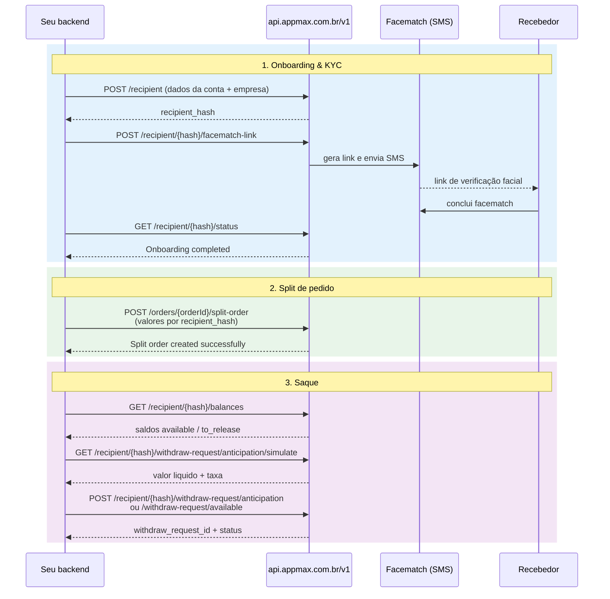

# Split de pagamentos

O split de pagamentos permite dividir o valor líquido de um pedido entre um marketplace e um ou mais recebedores (recipients) previamente cadastrados. Este guia apresenta o fluxo de ponta a ponta e as regras do produto. Os endpoints individuais estão detalhados nas páginas de referência linkadas ao final de cada etapa.

## Visão geral do fluxo

O processo se divide em três blocos:

1. **Onboarding & KYC** — cadastro do recebedor e verificação facial obrigatória.
2. **Split de pedido** — divisão do valor líquido do pedido entre marketplace e recebedores.
3. **Saque** — consulta de saldo e solicitação de retirada (com ou sem antecipação).

## Regras

- **Estornos parciais não são permitidos** em pedidos com split. Só estorno total.
- **Não é permitido criar ou alterar o split** de pedidos que já estão com status `aprovado`. Crie o split antes da aprovação do pagamento.
- O split é calculado sobre o **valor líquido** do pedido (após taxas da Appmax), não sobre o valor bruto. Exemplo:

| Componente                    | Valor       |
| ----------------------------- | ----------- |
| Pedido (bruto)                | R$ 100,00   |
| Valor líquido (após taxas)    | R$ 90,00    |
| Split para recebedores        | R$ 40,00    |
| Saldo do marketplace          | R$ 50,00    |

- Os valores nos payloads de split e saque são sempre informados **em centavos** (inteiros).

## Status do recebedor

O onboarding do recipient passa por três estados possíveis, retornados por `GET /recipient/{recipient_hash}/status`:

| Status                           | Significado                                                          |
| -------------------------------- | -------------------------------------------------------------------- |
| `Awaiting face match completion` | Recebedor ainda precisa completar o facematch (KYC) via SMS.         |
| `Onboarding on verification`     | Dados + facematch recebidos, em análise pela Appmax.                 |
| `Onboarding completed`           | Cadastro aprovado. Recebedor habilitado a receber splits.            |

Só é possível usar o `recipient_hash` em um split depois do status `Onboarding completed`.

Para a referência completa dos status — transições, elegibilidade por estado e status de solicitações de saque (`WithdrawRequest`) — consulte [Status do split de pagamentos](split_status.md).

## Etapas e endpoints

### Onboarding & KYC

1. [Criar um recebedor](../api/split/criar_recebedor.md) — `POST /recipient`
2. [Criar link de facematch (KYC)](../api/split/facematch_link.md) — `POST /recipient/{recipient_hash}/facematch-link`
3. [Consultar status do recebedor](../api/split/consultar_recebedor.md) — `GET /recipient/{recipient_hash}/status`

### Split de pedido

4. [Criar split de pedido](../api/split/criar_split_pedido.md) — `POST /orders/{orderId}/split-order`

### Saque

5. [Consultar saldos do recebedor](../api/split/saldos.md) — `GET /recipient/{recipient_hash}/balances`
6. [Simular antecipação de saque](../api/split/simular_antecipacao.md) — `GET /recipient/{recipient_hash}/withdraw-request/anticipation/simulate`
7. [Solicitar antecipação de saque](../api/split/solicitar_antecipacao.md) — `POST /recipient/{recipient_hash}/withdraw-request/anticipation`
8. [Solicitar saque com saldo disponível](../api/split/saque_disponivel.md) — `POST /recipient/{recipient_hash}/withdraw-request/available`
9. [Consultar solicitação de saque](../api/split/consultar_solicitacao_saque.md) — `GET /withdraw-request/{withdrawRequestId}`

## Diferença entre saque e antecipação

Há dois tipos de saldo e dois endpoints distintos para retirá-los:

| Tipo de saldo  | Endpoint                                                              | Uso                                                                  |
| -------------- | --------------------------------------------------------------------- | -------------------------------------------------------------------- |
| `available`    | `POST /recipient/{recipient_hash}/withdraw-request/available`         | Saldo já liberado. Saque direto, sem taxa de antecipação.            |
| `to_release`   | `POST /recipient/{recipient_hash}/withdraw-request/anticipation`      | Saldo ainda em compensação. Retirada antecipada com taxa aplicada.   |

Antes de solicitar uma antecipação, use o endpoint de [simulação](../api/split/simular_antecipacao.md) para exibir ao recebedor o valor líquido e a taxa aplicada — a simulação não cria solicitação nenhuma.

## Autenticação

Todas as rotas de split usam o mesmo esquema de autenticação descrito em [Autenticação](../primeiros_passos/autenticacao.md): `Authorization: Bearer <token>` com o token do **merchant** obtido via `POST /oauth2/token`. Credenciais do **app** não funcionam nessas rotas.

## Veja também

> **Dúvidas comuns sobre cadastro, edição, exclusão, KYC e SMS estão reunidas em [Perguntas frequentes — Split de pagamentos](split_faq.md).**
>
>

## Veja Também

- [Index Master](../index_master.md)
- [Criar Recebedor](../api/split/criar_recebedor.md)
- [Criar Recebedor Flexivel](../api/split/criar_recebedor_flexivel.md)
- [Facematch Link](../api/split/facematch_link.md)
