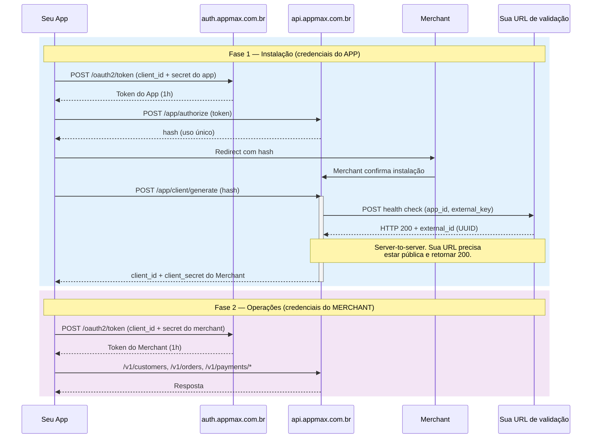

# Autenticação e autorização

## Qual credencial usar?

**Preciso instalar o app numa loja** → use credenciais do **APP** (obtidas no painel do desenvolvedor). Endpoints: `/app/authorize`, `/app/client/generate`.

**Preciso criar cliente, pedido ou pagamento** → use credenciais do **MERCHANT** (retornadas ao final da instalação). Endpoints: `/v1/customers`, `/v1/orders`, `/v1/payments/*`.

**Não sei qual usar** → já tem um merchant que instalou seu app? Se sim, use as do merchant. Se não, siga o [fluxo de instalação](../aplicativos/fluxo_instalacao.md) primeiro para obtê-las.

## Entendendo as credenciais

A API da Appmax utiliza **dois pares de credenciais** (`client_id` e `client_secret`). Ambos têm o mesmo formato, mas finalidades completamente diferentes. Confundir os dois é a causa mais comum de erros de integração.

### Credenciais do aplicativo (app credentials)

| Campo           | Descrição                                                          |
| --------------- | ------------------------------------------------------------------ |
| `client_id`     | Identificador do seu aplicativo na Appstore                        |
| `client_secret` | Chave secreta do aplicativo                                        |
| Obtidas em      | Painel do desenvolvedor, ao criar o aplicativo                     |
| Escopo          | Apenas fluxo de instalação (`/app/authorize`, `/app/client/generate`) |
| Validade        | Permanentes (enquanto o app existir)                               |

> **As credenciais do aplicativo **não permitem** criar clientes, pedidos ou pagamentos. Se você receber erro `401` ao chamar a API transacional, provavelmente está usando as credenciais erradas.**
>
>
### Credenciais do merchant (merchant credentials)

| Campo           | Descrição                                                          |
| --------------- | ------------------------------------------------------------------ |
| `client_id`     | Identificador único da instalação do app naquela loja              |
| `client_secret` | Chave secreta da instalação                                        |
| Obtidas em      | Retornadas ao final do fluxo de instalação (`/app/client/generate`) |
| Escopo          | Operações transacionais: clientes, pedidos, pagamentos, estornos   |
| Validade        | Permanentes (até o app ser desinstalado pelo merchant)             |

> **Para cada merchant que instala seu app, você recebe um par de credenciais diferente. Armazene-as de forma segura associadas ao merchant correspondente.**
>
>
### Comparação rápida

| Aspecto                 | Credenciais do app                    | Credenciais do merchant                |
| ----------------------- | ------------------------------------- | -------------------------------------- |
| Quando são geradas      | Ao criar o app no painel              | Ao final do fluxo de instalação        |
| Quantas existem         | 1 par por app                         | 1 par por merchant que instalou o app  |
| O que permitem fazer    | Iniciar instalação, gerar credenciais | Criar clientes, pedidos, pagamentos    |
| Endpoint de autenticação | `POST /oauth2/token`                 | `POST /oauth2/token` (mesmo endpoint) |
| Expiram                 | Não                                   | Não (até desinstalação)                |
| Token gerado expira em  | 1 hora                                | 1 hora                                 |

> **Ambas usam o **mesmo endpoint** (`https://auth.appmax.com.br/oauth2/token`) com o **mesmo formato de requisição**. A única diferença é qual `client_id` e `client_secret` você envia. O token retornado terá permissões diferentes conforme a credencial usada.**
>
>
### Fluxo visual



## Erros comuns com credenciais

| Erro | Causa provável | Solução |
| ---- | -------------- | ------- |
| `401` ao criar cliente/pedido | Usando credenciais do **app** em vez do **merchant** | Use as credenciais retornadas por `/app/client/generate` |
| `401` ao chamar `/app/authorize` | Usando credenciais do **merchant** em vez do **app** | Use as credenciais do painel do desenvolvedor |
| `500` ao chamar `/app/client/generate` | Fluxo de instalação incompleto (faltou redirect) | Siga as 4 etapas do fluxo de instalação na ordem |
| `401` token expirado | Token JWT com mais de 1 hora | Gere um novo token com as mesmas credenciais |
| `403` em `/oauth2/token` | Endpoint errado (usando URL da API em vez de auth) | Use `https://auth.appmax.com.br/oauth2/token` |

## Por que não utilizamos refresh tokens?

A API adota um modelo de autenticação sem refresh tokens. Essa decisão baseia-se na arquitetura de comunicação server-to-server.

> **Motivos detalhados**
>
> 1. **Natureza server-to-server:** a comunicação ocorre diretamente entre servidores, em ambientes controlados e seguros. Isso reduz a necessidade de mecanismos adicionais para renovação de tokens.
>
> 2. **Segurança e simplicidade:** tokens de curta duração (1 hora) limitam a janela de uso. Em ambientes server-to-server, onde credenciais são armazenadas de forma segura, essa abordagem simplifica o gerenciamento.
>
> 3. **Redução de complexidade:** elimina o armazenamento seguro de refresh tokens, rotação de tokens e lógica de renovação.
>
> 4. **Conformidade com melhores práticas:** em integrações server-to-server, é comum utilizar tokens de acesso curtos com autenticação baseada em chaves.
## Obtendo o token

#### 1. Autenticação

Envie as credenciais do **merchant** (para operações transacionais) ou do **app** (para fluxo de instalação).

#### 2. Token de curta duração

Após a autenticação, um token de acesso de 1 hora é emitido e deve ser usado em todas as requisições subsequentes.

#### 3. Renovação do token

Quando o token expira, obtenha um novo através do mesmo processo de autenticação inicial.

### Exemplo com credenciais do merchant

```bash
curl --location 'https://auth.appmax.com.br/oauth2/token' \
--header 'Content-Type: application/x-www-form-urlencoded' \
--data-urlencode 'grant_type=client_credentials' \
--data-urlencode 'client_id=MERCHANT_CLIENT_ID' \
--data-urlencode 'client_secret=MERCHANT_CLIENT_SECRET'
```

```json
{
  "access_token": "eyJhbGciOiJIUzI1NiIsInR5cCI6Ikp...",
  "token_type": "Bearer",
  "expires_in": 3600
}
```

### Exemplo com credenciais do app

```bash
curl --location 'https://auth.appmax.com.br/oauth2/token' \
--header 'Content-Type: application/x-www-form-urlencoded' \
--data-urlencode 'grant_type=client_credentials' \
--data-urlencode 'client_id=APP_CLIENT_ID' \
--data-urlencode 'client_secret=APP_CLIENT_SECRET'
```

> **O `client_id` e `client_secret` do merchant nunca são alterados. Só é possível gerar novos realizando novas instalações e desativar os atuais realizando a desinstalação.**
>
>

## Veja Também

- [Index Master](../index_master.md)
- [Quickstart](quickstart.md)
- [Appmax Js](appmax_js.md)
