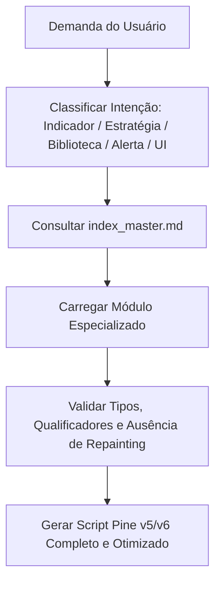

# Skill — Pine Script v5 / v6 (TradingView)

## Identidade e Propósito
Base de conhecimento de engenharia e referência técnica avançada para desenvolvimento de indicadores, estratégias quantitativas, bibliotecas reutilizáveis, painéis gráficos (dashboards) e automação de alertas na linguagem TradingView Pine Script (versões 5 e 6).

Esta Skill é fundamentada em 100% da documentação oficial do TradingView, cobrindo o modelo de execução em séries temporais, sistema rigoroso de tipos e qualificadores, estruturas de dados dinâmicas (UDTs, Enums, Arrays, Matrizes, Maps e Métodos OOP), renderização visual de alta performance, requisições multi-tempo gráfico sem repainting e execução de ordens com backtesting institucional.

---

## Regras Fundamentais de Engenharia Pine Script

1. **Roteamento Obrigatório**: Consulte sempre o `index_master.md` para mapear a intenção da tarefa ao arquivo temático correto antes de redigir qualquer código.
2. **Versão e Diretiva de Compilação**:
   - Todo script deve iniciar explicitamente com `//@version=5` ou `//@version=6`.
   - Preferir a versão 5 ou 6, utilizando namespaces padronizados (`ta.*`, `math.*`, `request.*`, `strategy.*`, `str.*`, `color.*`). Nunca use sintaxe legada v3/v4 (`study()`, `security()`, `iff()`).
3. **Qualificadores de Tipo e Compatibilidade**:
   - Respeite rigorosamente a hierarquia de qualificadores: `const` < `input` < `simple` < `series`.
   - Lembre-se: funções que exigem `simple` ou `const` (como o argumento `timeframe` ou `length` em certas funções built-in) NÃO aceitam qualificadores `series`.
4. **Modelo de Execução e Imutabilidade de Histórico**:
   - Compreenda a execução barra por barra da esquerda para a direita.
   - Variáveis normais são recalculadas a cada barra ou tick; use `var` para manter o estado persistente entre barras históricas e realtime, e `varip` para manter o estado intra-bar (sem rollback em ticks realtime).
5. **Prevenção Rígida de Repainting**:
   - Em chamadas `request.security()`, nunca acesse dados futuros acidentalmente. Utilize o padrão não-repainting: `request.security(syminfo.tickerid, timeframe.period, expression[1], barmerge.gaps_off, barmerge.lookahead_off)`.
   - Em estratégias, evite `calc_on_every_tick=true` sem o entendimento de que os preenchimentos em tempo real diferem dos históricos.
6. **Gerenciamento de Recursos e Limites de Compilação**:
   - Respeite os limites máximos do runtime do Pine Script: máximo de 500 linhas/caixas/labels/tabelas ativas na tela, 500.000 iterações em laços por barra, 40 chamadas `request.security()`, e uso adequado de `max_bars_back` quando o compilador não consegue inferir o buffer histórico.
7. **Código Completo e Executável**:
   - Nunca forneça trechos de código com reticências ou omissões (`...`). Todo código gerado deve ser um script Pine Script 100% executável, com declaração inicial (`indicator()`, `strategy()` ou `library()`), inputs estruturados e plotagem/execução.

---

## Fluxo Operacional Recomendado

1. **Classificação da Demanda**: Identifique se o objetivo é criar um Indicador visual, uma Estratégia com ordens de backtesting, uma Biblioteca compartilhada, um Dashboard de Tabelas ou um Sistema de Alertas webhook.
2. **Consulta ao Índice**: Navegue através de `index_master.md` para carregar as funções e métodos built-in adequados.
3. **Validação de Restrições**: Cheque se há dependências de séries históricas (`[]`), mutabilidade (`:=`), tipos compostos (`type`, `enum`, `array`, `matrix`, `map`) e qualificadores.
4. **Codificação Sem Abreviações**: Estruture o script seguindo o Guia de Estilo oficial: diretiva de versão -> declaração -> constantes/inputs -> tipos/métodos -> cálculos lógicos -> saídas gráficas/estratégicas -> alertas.

---

## Mapa Geral dos Módulos

| Subdiretório | Foco Temático |
|---|---|
| `primeiros_passos/` | Fundamentos, declarações `//@version=5/6`, `indicator()`, `strategy()`, estrutura léxica e Pine Editor |
| `modelo_de_execucao_e_series/` | Mecanismo de barras, time series, operador `[]`, tratamento de `na` e ciclo de vida `barstate.*` |
| `sistema_de_tipos_e_sintaxe/` | Tipagem, qualificadores (`const`/`series`), variáveis (`var`/`varip`), operadores, `if`/`switch`, loops e UDFs |
| `estruturas_de_dados_avancadas/` | Objetos UDT, Enums, Vetores dinâmicos (`array.*`), Álgebra linear (`matrix.*`), Dicionários (`map.*`) e Métodos OOP |
| `visualizacao_e_elementos_graficos/` | Plots, preenchimentos, cores dinâmicas, `line.*`, `box.*`, `polyline.*`, `label.*` e `table.*` |
| `entradas_alertas_e_dados_externos/` | Inputs configuráveis, webhooks de alertas com placeholders e requisições multi-tempo sem repainting |
| `estrategias_e_backtesting/` | Parâmetros de `strategy()`, dimensionamento de posições, stop loss/take profit/trailing, métricas e análise de fills |
| `bibliotecas_boas_praticas_e_troubleshooting/` | Publicação de bibliotecas (`library()`), guia de estilo, limites de runtime, catálogo de erros e migração v4 -> v5 -> v6 |
