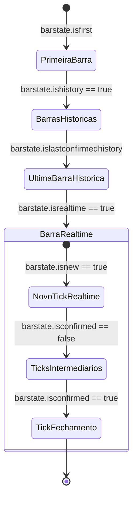

# Bar States e Ciclo de Vida da Barra no Pine Script

O Pine Script fornece um conjunto de variáveis booleanas embutidas no namespace `barstate.*` que descrevem o estado exato de processamento da barra na iteração atual. Elas permitem controlar quando determinados cálculos caros devem ser executados e garantem que alertas e sinais sejam disparados no momento correto.

---

## 1. Tabela de Variáveis `barstate.*`

| Variável | Tipo | `true` Quando... |
|---|---|---|
| `barstate.isfirst` | `series bool` | O script está executando na **primeiríssima barra** do gráfico disponível no histórico (`bar_index == 0`). |
| `barstate.islast` | `series bool` | O script está executando na **última barra atual** do gráfico (seja ela histórica fechada ou realtime aberta). |
| `barstate.ishistory` | `series bool` | O script está processando qualquer **barra histórica já fechada e consolidada**. |
| `barstate.isrealtime` | `series bool` | O script está executando na **barra em tempo real**, que ainda está aberta e recebendo ticks. |
| `barstate.isnew` | `series bool` | A iteração atual é o **primeiro tick** de uma nova barra. |
| `barstate.isconfirmed` | `series bool` | O script está executando no **último tick de fechamento** da barra atual. Na próxima iteração, uma nova barra se iniciará. |
| `barstate.islastconfirmedhistory` | `series bool` | A barra atual é a **última barra histórica confirmada** antes do início dos dados em tempo real. |

---

## 2. Diagrama de Transição de Estados da Barra



---

## 3. Padrões de Uso Críticos

### Padrão 1: Execução Exclusiva na Barra Confirmada (Anti-Repainting de Alertas)
Disparar alertas ou registrar ordens apenas no momento em que a barra fecha impede que sinais falsos gerados no meio da barra sejam contabilizados.

```pinescript
if buySignal and barstate.isconfirmed
    alert("Sinal Confirmado de Compra no Fechamento!", alert.freq_once_per_bar_close)
```

### Padrão 2: Otimização de Performance (Cálculo apenas na Última Barra)
Tabelas visuais complexas, painéis e desenhos de suporte/resistência baseados em dados globais devem ser executados apenas em `barstate.islast` para evitar desperdício de CPU nas milhares de barras históricas anteriores.

```pinescript
if barstate.islast
    // Renderiza a tabela do dashboard apenas uma vez na última barra
    table.cell(myTable, 0, 0, "Dashboard Ativo")
```

---

## 4. Script Completo: Analisador de Estados de Barra em Tempo Real

```pinescript
//@version=5
indicator("Analisador de Ciclo de Vida — Bar States Master", overlay=true)

// Cores de fundo dinâmicas para cada estado
color stateColor = na

if barstate.isfirst
    stateColor := color.new(color.blue, 70)
else if barstate.islastconfirmedhistory
    stateColor := color.new(color.purple, 70)
else if barstate.isrealtime and barstate.isnew
    stateColor := color.new(color.yellow, 70)
else if barstate.isrealtime and barstate.isconfirmed
    stateColor := color.new(color.green, 70)

bgcolor(stateColor, title="Destaque de Estado da Barra")

// Painel Diagnóstico de Estados
var table stateTable = table.new(position.bottom_right, 2, 8, bgcolor=color.rgb(20, 20, 25), border_color=color.gray, border_width=1)

if barstate.islast
    // Cabeçalho
    table.cell(stateTable, 0, 0, "Variável Barstate", text_color=color.white, bgcolor=color.navy)
    table.cell(stateTable, 1, 0, "Status Atual", text_color=color.white, bgcolor=color.navy)
    
    // Linhas de Estados
    table.cell(stateTable, 0, 1, "barstate.isfirst", text_color=color.white)
    table.cell(stateTable, 1, 1, str.tostring(barstate.isfirst), text_color=barstate.isfirst ? color.green : color.red)
    
    table.cell(stateTable, 0, 2, "barstate.ishistory", text_color=color.white)
    table.cell(stateTable, 1, 2, str.tostring(barstate.ishistory), text_color=barstate.ishistory ? color.green : color.red)
    
    table.cell(stateTable, 0, 3, "barstate.islastconfirmedhistory", text_color=color.white)
    table.cell(stateTable, 1, 3, str.tostring(barstate.islastconfirmedhistory), text_color=barstate.islastconfirmedhistory ? color.green : color.red)
    
    table.cell(stateTable, 0, 4, "barstate.isrealtime", text_color=color.white)
    table.cell(stateTable, 1, 4, str.tostring(barstate.isrealtime), text_color=barstate.isrealtime ? color.green : color.red)
    
    table.cell(stateTable, 0, 5, "barstate.isnew", text_color=color.white)
    table.cell(stateTable, 1, 5, str.tostring(barstate.isnew), text_color=barstate.isnew ? color.green : color.red)
    
    table.cell(stateTable, 0, 6, "barstate.isconfirmed", text_color=color.white)
    table.cell(stateTable, 1, 6, str.tostring(barstate.isconfirmed), text_color=barstate.isconfirmed ? color.green : color.red)
    
    table.cell(stateTable, 0, 7, "barstate.islast", text_color=color.white)
    table.cell(stateTable, 1, 7, str.tostring(barstate.islast), text_color=barstate.islast ? color.green : color.red)

// Plotagem básica para ancoragem
plot(close, title="Preço de Fechamento", color=color.gray)
```
