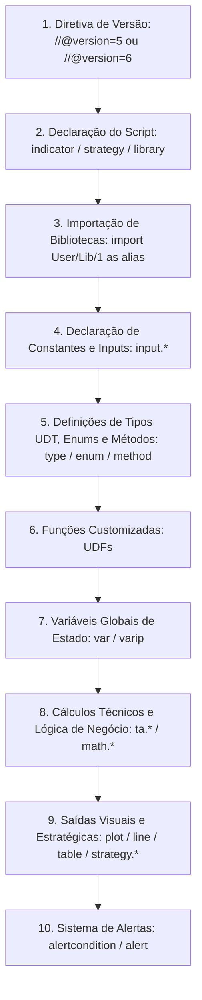

# Estrutura do Script e Compilador Pine Script

Pine Script opera com uma estrutura léxica bem definida. Entender a sequência canônica de código, as regras de identação do compilador e as restrições de quebra de linha é essencial para escrever códigos limpos, legíveis e livres de erros de compilação.

---

## 1. Anatomia Canônica de um Script Pine Script

Todo script profissional em Pine Script deve seguir rigorosamente a seguinte ordem de seções:



### Exemplo Estrutural Completo

```pinescript
//@version=5
// 1. DIRETIVA DE COMPILAÇÃO

// 2. DECLARAÇÃO DO SCRIPT
indicator("Estrutura Canônica Profissional", shorttitle="ECP", overlay=true)

// 3. IMPORTAÇÕES DE BIBLIOTECAS (Opcional)
// import PineCoders/VisibleChart/4 as pc

// 4. CONSTANTES E INPUTS
COLOR_BULLISH = color.green
COLOR_BEARISH = color.red
lenInput      = input.int(14, title="Período do Canal", minval=1)
showChannel   = input.bool(true, title="Exibir Canal de Preço")

// 5. DEFINIÇÃO DE TIPOS E ENUMS
type PriceChannel
    float upper
    float lower
    float middle

// 6. FUNÇÕES DEFINIDAS PELO USUÁRIO (UDFs)
calcChannel(int len) =>
    h = ta.highest(high, len)
    l = ta.lowest(low, len)
    m = math.avg(h, l)
    PriceChannel.new(h, l, m)

// 7. VARIÁVEIS GLOBAIS DE ESTADO (var / varip)
var int breakoutCount = 0

// 8. CÁLCULOS TÉCNICOS
channel = calcChannel(lenInput)
isBreakoutHigh = ta.crossover(close, channel.upper[1])
if isBreakoutHigh
    breakoutCount += 1

// 9. SAÍDAS VISUAIS
pUp  = plot(showChannel ? channel.upper : na, title="Canal Superior", color=COLOR_BULLISH)
pLow = plot(showChannel ? channel.lower : na, title="Canal Inferior", color=COLOR_BEARISH)
pMid = plot(showChannel ? channel.middle : na, title="Centro do Canal", color=color.gray)
fill(pUp, pLow, color=color.new(color.blue, 95), title="Preenchimento")

// 10. ALERTAS
alertcondition(isBreakoutHigh, title="Rompimento de Alta", message="O ativo {{ticker}} rompeu a máxima dos últimos " + str.tostring(lenInput) + " períodos!")
```

---

## 2. Regras de Identação e Escopo de Blocos

Pine Script utiliza identação significativa para delimitar blocos locais (dentro de funções `=>`, condicionais `if`/`else` e laços `for`/`while`).

### Regra de Ouro da Identação
- **Blocos Locais**: Devem ser identados com **4 espaços** ou **1 tabulação**.
- **Identação Adicional**: Cada nível aninhado subsequente requer mais 4 espaços (ex: 8 espaços para um `if` dentro de outro `if`).
- **Escopo Global**: Qualquer código que não pertença a uma função ou estrutura condicional/laço DEVE começar na coluna 1 (sem espaços iniciais).

```pinescript
//@version=5
indicator("Exemplo de Escopos e Identação", overlay=true)

// Nível 0: Escopo Global (coluna 1)
calcSignal(float src, int length) =>
    // Nível 1: Bloco da Função (4 espaços)
    ma = ta.sma(src, length)
    diff = src - ma
    
    result = if diff > 0
        // Nível 2: Bloco do IF dentro da função (8 espaços)
        1.0
    else
        // Nível 2: Bloco do ELSE dentro da função (8 espaços)
        -1.0
    
    // Nível 1: Retorno da Função (4 espaços)
    result

// Nível 0: Chamada no Escopo Global
sig = calcSignal(close, 20)
plot(sig, title="Sinal Normalizado")
```

---

## 3. Regras de Continuação de Linhas (Line Wrapping)

Quando uma expressão, chamada de função ou lista de parâmetros for muito longa para caber em uma única linha, você pode quebrá-la em múltiplas linhas seguindo estas regras obrigatórias:

1. **Identação de Continuação**: A linha de continuação DEVE ser identada com um número de espaços que **NÃO seja múltiplo de 4** (por exemplo, 2, 3, 5 ou 6 espaços), ou deve ser identada além do nível normal do bloco. O compilador interpreta 4 espaços como o início de um novo bloco local.
2. **Quebra após Operadores**: Recomenda-se quebrar a linha imediatamente após vírgulas `,`, operadores aritméticos `+`, `-`, `*`, `/`, operadores lógicos `and`, `or` ou o operador ternário `?`.

```pinescript
//@version=5
indicator("Exemplo de Line Wrapping Correto", overlay=true)

// Continuação correta de declaração de input longo
emaPeriod = input.int(
     defval=50,
     title="Período Muito Longo da Média Móvel Exponencial",
     minval=1,
     maxval=500,
     step=5,
     tooltip="Esta configuração ajusta a sensibilidade da tendência primária no gráfico."
  )

// Continuação correta de expressão matemática longa
trendCondition = (close > ta.sma(close, 20)) and 
     (ta.rsi(close, 14) > 50) and 
     (volume > ta.sma(volume, 20)) and 
     (high - low > ta.atr(14))

plot(emaPeriod, title="Valor do Input")
```

---

## 4. Comentários e Documentação do Compilador

| Tipo de Comentário | Sintaxe | Uso Recomendado |
|---|---|---|
| Comentário de Linha Única | `// texto` | Explicações de lógica, desativação temporária de código. |
| Comentário de Fim de Linha | `val = 10 // valor base` | Notas pontuais sobre variáveis ou parâmetros. |
| Anotações de Compilador | `//@version=5`, `//@description` | Metadados interpretados pelo compilador do TradingView. |
| Tags de Documentação de Biblioteca | `//@function`, `//@param`, `//@returns` | Documentação formal exportada no painel de bibliotecas. |

---

## 5. O Ambiente de Desenvolvimento (Pine Editor)

O Pine Editor no TradingView fornece:
- **Auto-complete Inteligente**: Pressione `Ctrl + Space` para autocompletar nomes de funções built-in e variáveis.
- **Ajuda de Sintaxe Inline**: Pressione `Ctrl + Clique` (ou `Cmd + Clique` no macOS) em qualquer função built-in para abrir o pop-up com a assinatura oficial e tipos de retorno.
- **Console de Erros**: Informa linha, coluna e descrição exata do erro (`Compilation error`, `Syntax error`, `Type mismatch`).
- **Pine Logs (`log.info()`, `log.warning()`, `log.error()` no Pine v5/v6)**: Permite registrar mensagens de depuração em tempo de execução na janela de logs.
