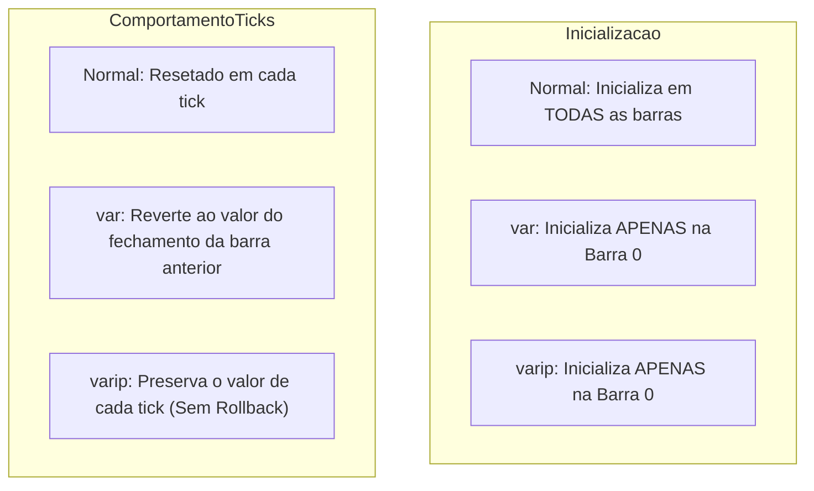

# Declaração de Variáveis, Reatribuição e Persistência (`var` / `varip`)

No Pine Script, a manipulação de variáveis envolve três conceitos cruciais: o operador de declaração inicial `=`, o operador de reatribuição `:=`, e os modificadores de persistência de estado `var` e `varip`.

---

## 1. Operador de Declaração `=` vs Operador de Reatribuição `:=`

1. **Operador `=` (Declaração Inicial)**:
   - Cria uma nova variável na memória e atribui seu valor inicial.
   - Opcionalmente, pode ser precedido pela anotação de tipo explícito (ex: `int x = 10` ou `float y = 5.5`).
2. **Operador `:=` (Reatribuição / Mutação)**:
   - Modifica o valor de uma variável que **já foi declarada previamente**.
   - Tentar utilizar `=` para alterar uma variável existente no mesmo escopo resulta em erro de compilação ou sombreamento indesejado.

```pinescript
//@version=5
indicator("Declaração vs Reatribuição", overlay=true)

// Declaração inicial de variável
float precoReferencia = open

// Reatribuição condicional (DEVE usar :=)
if close > open
    precoReferencia := high
else
    precoReferencia := low

plot(precoReferencia, title="Preço de Referência", color=color.orange)
```

---

## 2. Modificadores de Persistência: Normal vs `var` vs `varip`

| Modificador | Inicialização | Comportamento no Histórico | Comportamento em Tempo Real (Ticks) |
|---|---|---|---|
| **Sem modificador (Normal)** | A cada barra | Recalculado a cada nova barra | Recalculado e sofre **rollback** antes de cada tick |
| **`var`** | Apenas na **primeira barra** (`bar_index == 0`) | Retém o valor da barra anterior até ser reatribuído | Sofre **rollback** a cada tick, preservando o valor da última barra fechada |
| **`varip`** (Var Intrabar Persist) | Apenas na **primeira barra** (`bar_index == 0`) | Idêntico ao `var` | **NÃO sofre rollback**; persiste mutações entre ticks da mesma barra aberta |



---

## 3. Escopo de Variáveis e Sombreamento (Shadowing)

- **Escopo Global**: Variáveis declaradas fora de qualquer bloco de função, `if`, `switch`, `for` ou `while`. Ficam acessíveis em todo o script.
- **Escopo Local**: Variáveis declaradas dentro de um bloco identado. Existem apenas durante a execução daquele bloco.
- **Sombreamento (Shadowing)**: Ocorre quando uma variável local é declarada com o operador `=` utilizando o mesmo nome de uma variável global. A variável global permanece inalterada fora do bloco.

```pinescript
//@version=5
indicator("Exemplo de Escopo e Shadowing", overlay=false)

var int globalCount = 0

if close > open
    // Reatribuição da variável global (modifica o estado global)
    globalCount := globalCount + 1
    
    // Declaração de variável local com o mesmo nome (Shadowing - CUIDADO!)
    int localOnly = 100

// localOnly NÃO existe aqui fora; tentar acessá-la geraria erro de compilação
plot(globalCount, title="Contagem Global de Velas de Alta", color=color.green)
```

---

## 4. Script Completo: Rastreador de Máximas Históricas e Ticks com `var` e `varip`

```pinescript
//@version=5
indicator("Rastreador de Extremos e Micro-Volume com VAR e VARIP", overlay=true)

// 1. RASTREADOR COM VAR: Recorde Histórico de Preço (All-Time High / All-Time Low)
var float allTimeHigh = na
var float allTimeLow  = na

if na(allTimeHigh) or (high > allTimeHigh)
    allTimeHigh := high

if na(allTimeLow) or (low < allTimeLow)
    allTimeLow := low

// 2. RASTREADOR COM VARIP: Contador de Ticks de Alta vs Baixa na Barra Realtime
varip int upticksCount   = 0
varip int downticksCount = 0
varip float lastTickPrice = na

if barstate.isrealtime
    if not na(lastTickPrice)
        if close > lastTickPrice
            upticksCount += 1
        else if close < lastTickPrice
            downticksCount += 1
    lastTickPrice := close

// Reseta os contadores no início de cada nova barra
if barstate.isnew
    upticksCount   := 0
    downticksCount := 0

// 3. PLOTS E VISUALIZAÇÃO
plot(allTimeHigh, title="Máxima Histórica (ATH)", color=color.green, linewidth=2)
plot(allTimeLow,  title="Mínima Histórica (ATL)", color=color.red, linewidth=2)

// Tabela de monitoramento de micro-ticks em tempo real
var table tickTable = table.new(position.top_right, 2, 3, bgcolor=color.black, border_width=1)
if barstate.islast
    table.cell(tickTable, 0, 0, "Ticks de Alta (varip)", text_color=color.green)
    table.cell(tickTable, 1, 0, str.tostring(upticksCount), text_color=color.green)
    table.cell(tickTable, 0, 1, "Ticks de Baixa (varip)", text_color=color.red)
    table.cell(tickTable, 1, 1, str.tostring(downticksCount), text_color=color.red)
```
