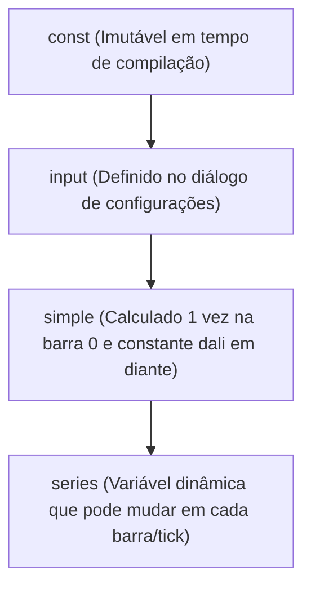

# Sistema de Tipos e Qualificadores no Pine Script

O sistema de tipos do Pine Script combina um **Tipo de Dado Fundamental** (como `int`, `float`, `string`) com um **Qualificador de Forma/Comportamento** (como `const`, `input`, `simple`, `series`). Cada variável possui uma tipagem composta no formato `<qualificador> <tipo>` (por exemplo: `series float`, `const int`, `simple string`).

---

## 1. Tipos de Dados Fundamentais

| Tipo Fundamental | Descrição | Exemplo de Valor Literal |
|---|---|---|
| `int` | Número inteiro positivo ou negativo de 32 bits | `42`, `-10`, `0` |
| `float` | Número de ponto flutuante de precisão dupla | `3.14159`, `10.0`, `-0.005` |
| `bool` | Valor booleano de lógica binária | `true`, `false` |
| `color` | Representação de cor RGBA com canal alfa (transparência) | `color.red`, `#2196F3`, `color.rgb(255, 0, 0, 50)` |
| `string` | Cadeia de caracteres de texto formatado | `"EURUSD"`, `'Alta de Preço'`, `"60"` |
| `line` | Identificador de referência a um objeto gráfico de segmento de linha | Retornado por `line.new()` |
| `box` | Identificador de referência a uma caixa/retângulo gráfico | Retornado por `box.new()` |
| `polyline` | Identificador de referência a uma polilinha com múltiplos vértices | Retornado por `polyline.new()` |
| `label` | Identificador de referência a uma etiqueta de texto flutuante | Retornado por `label.new()` |
| `table` | Identificador de referência a uma tabela/painel fixo na tela | Retornado por `table.new()` |
| `chart.point` | Estrutura de ponto de coordenadas 2D (`index`/`time` e `price`) | Retornado por `chart.point.new()` |
| User-Defined Type (UDT) | Estrutura customizada definida por `type` | Instanciada por `TypeName.new()` |
| Enum | Conjunto fechado de identificadores nomeados | Definido por `enum` |

---

## 2. A Hierarquia dos 4 Qualificadores de Tipo

Os qualificadores determinam **quando** o valor da variável é conhecido e **se** ele pode variar de barra para barra.



### Detalhamento dos Qualificadores:

1. **`const`**:
   - Conhecido no momento exato em que o script é compilado.
   - Não depende de dados de mercado, gráficos ou configurações do usuário.
   - Exemplo: `100`, `"Meu Titulo"`, `color.blue`.
2. **`input`**:
   - Conhecido após a inicialização do script através dos valores informados nas funções `input.*()`.
   - Permanece imutável durante a execução barra por barra.
   - Exemplo: `input.int(14, "Período")`.
3. **`simple`**:
   - Calculado uma única vez na primeiríssima barra (`bar_index == 0`) e permanece fixo para todas as barras.
   - Exemplo: `syminfo.tickerid`, `syminfo.mintick`, `timeframe.period`.
4. **`series`**:
   - O qualificador mais flexível. Pode assumir um valor diferente em cada barra do histórico e em cada tick.
   - Exemplo: `close`, `high`, `ta.sma(close, 20)`, `bar_index`.

---

## 3. Matriz de Compatibilidade e Promoção Automática de Tipos

Uma variável com qualificador mais rígido pode ser promovida automaticamente para um qualificador mais dinâmico, mas **o inverso é estritamente proibido**.

| De \ Para | `const` | `input` | `simple` | `series` |
|---|:---:|:---:|:---:|:---:|
| **`const`** | Permite | Permite | Permite | Permite |
| **`input`** | **Erro** | Permite | Permite | Permite |
| **`simple`** | **Erro** | **Erro** | Permite | Permite |
| **`series`** | **Erro** | **Erro** | **Erro** | Permite |

> **Erro Clássico de Compilação**:
> Tentar passar uma variável `series string` (ex: calculada dinamicamente com `if`) no argumento `timeframe` de `request.security()`. O compilador falha com:
> `Cannot call 'request.security' with argument 'timeframe'='series string'. An argument of 'simple string' was expected.`

---

## 4. Script Demonstrativo Completo de Tipos e Qualificadores

```pinescript
//@version=5
indicator("Sistema de Tipos & Qualificadores Master", overlay=false)

// 1. CONSTANTES (const)
CONST_PI       = 3.14159265359     // const float
CONST_MAX_VAL  = 100               // const int
CONST_LABEL    = "Valor do Canal"  // const string

// 2. INPUTS (input)
inputLen       = input.int(14, title="Período Base")          // input int
inputMult      = input.float(2.0, title="Multiplicador")      // input float
inputColor     = input.color(color.blue, title="Cor da Linha") // input color

// 3. VALORES SIMPLES (simple)
symbName       = syminfo.ticker        // simple string
tickSize       = syminfo.mintick       // simple float

// 4. SÉRIES TEMPORAIS (series)
seriesSource   = close                 // series float
seriesSma      = ta.sma(close, inputLen) // series float
seriesCond     = close > seriesSma     // series bool
seriesDynColor = seriesCond ? color.green : color.red // series color

// 5. VALIDAÇÃO DE CONVERSÃO EXPLÍCITA
intFromFloat   = int(seriesSource)     // casting explícito de float para int
strFromInt     = str.tostring(intFromFloat) // conversão para string formatada

plot(seriesSma, title="Média Móvel Dinâmica", color=seriesDynColor, linewidth=2)
plot(tickSize, title="Tamanho do Tick (Simple)", color=color.gray)
```
